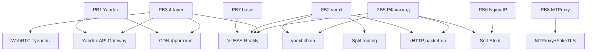

# Applied RF — пошаговые сценарии (playbooks)

11 сценариев из 10 загруженных статей + дополнительные Habr-источники (см. [[_sources]]). Сортировка от простого к сложному.

## По сложности

| PB | Название | Use case | Сложность | Цена/мес |
|---|---|---|---|---|
| [[PB7 — basic VLESS-Reality с нуля]] | Базовый VLESS-Reality | домашний интернет (не whitelist) | low | $3 |
| [[PB4 — диагностика whitelist]] | Диагностика своего провайдера | разведка | low | $0 |
| [[PB8 — MTProxy + FakeTLS]] | Только Telegram | Telegram-блокировки | low | $3 |
| [[PB1 — Yandex API Gateway фронтинг]] | Mobile-whitelist обход через Yandex | mobile-whitelist | medium | ~₽300 |
| [[PB2 — vnext-цепочка через РФ-мост]] | 2-уровневая цепочка | whitelist + session-freezing | high | ~₽400 |
| [[PB6 — Nginx+LE с разделением IP]] | Self-Steal с двумя IP | анти-profile-IP | high | $5 |
| [[PB5 — РФ-каскад с xHTTP+packet-up]] | РФ-мост с Self-Steal + xHTTP | продвинутый whitelist-обход | high | ~₽500 |
| [[PB3 — 4-уровневая архитектура за 265₽]] | Multi-уровневый fault-tolerant | максимальная resilience | very high | ₽265 |
| [[PB9 — Hysteria-2 setup]] | QUIC-VPN с masquerade | lossy mobile / без whitelist | medium | $3 |
| [[PB10 — DNSTT-туннель]] | DNS-tunnel last-resort | mobile-whitelist + всё уже не работает | high | $3 |
| [[PB11 — Self-Steal-only без РФ-моста]] | Self-Steal на одном внешнем VPS | домашний интернет, без cascade | medium | $3-5 |

## По источнику ситуации

### «Я на домашнем РФ-провайдере, всё-таки хочу VPN»
Старт: [[PB7 — basic VLESS-Reality с нуля]] (~$3/мес VPS Hetzner + Hiddify).

**Если** [[Session freezing]] (см. [[PB4 — диагностика whitelist]] для проверки):
→ перейти на [[PB5 — РФ-каскад с xHTTP+packet-up]] или [[PB2 — vnext-цепочка через РФ-мост]].

### «Я на mobile-whitelist (МТС/Билайн/МегаФон)»
Прямой VPN не работает (см. [[Белые списки]]). Варианты:
1. [[PB1 — Yandex API Gateway фронтинг]] — самый быстрый старт.
2. [[PB2 — vnext-цепочка через РФ-мост]] — больше контроля.
3. [[PB3 — 4-уровневая архитектура за 265₽]] — самое надёжное.

### «Мне нужен только Telegram»
[[PB8 — MTProxy + FakeTLS]] — без OS-VPN, прямо в Telegram-клиенте.

### «Я провайдер VPN, нужна resilience»
[[PB3 — 4-уровневая архитектура за 265₽]] + [[PB6 — Nginx+LE с разделением IP]].

## Карта концептуальных компонентов

## Что может сломаться (cross-cut)

| Симптом | Возможная причина | Решение |
|---|---|---|
| TCP timeout без RST | IP-blacklist на L3 | сменить provider/IP |
| 16 KB передал, дальше тишина | [[Session freezing]] | xHTTP packet-up или vnext-цепочка |
| ClientHello не идёт ServerHello | [[SNI-фильтрация]] | сменить SNI/target/Reality |
| DNS не резолвит | whitelist-DNS | Yandex DoH вместо Cloudflare |
| Связь рвётся раз в 5 минут | active probing | проверить Self-Steal-fallback |
| Mobile-internet работает только на whitelist | mobile whitelist-mode | [[PB1]] / [[PB2]] / [[PB3]] |

## Куда дальше
- [[applied-rf-status]] — рабочее vs сломанное.
- [[applied-rf-glossary]] — определения.
