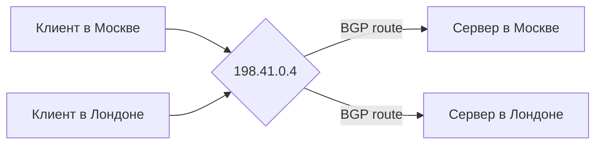

# Anycast

## TL;DR
**Один IP-адрес — много экземпляров сервиса в разных местах**. Маршрутизация (через [[BGP]]) приведёт пакет к **ближайшему** экземпляру. Используется в DNS-корнях (`a.root-servers.net` — много физических серверов на одном IP), CDN (Cloudflare, Akamai) и anti-DDoS-сервисах. Прозрачно для клиента — он видит просто IP, не зная про несколько копий.

## Какую проблему решает
Для **глобально распределённого сервиса** (DNS, CDN) нужны:
- Низкая задержка (близко к клиенту).
- Отказоустойчивость (упал один узел — продолжаем).
- Защита от DDoS (распределение нагрузки).

Если выдавать клиенту разные IP в разных регионах через DNS — это работает, но требует учёта геолокации в DNS-резолверах. Anycast делает это **на уровне сетевой маршрутизации**: один IP, несколько физических точек, BGP сам выберет ближайшую.

## Как работает

**На стороне сервиса:**
- Один и тот же префикс (например, `198.41.0.4/32` для DNS-корня A) **анонсируется в BGP** из нескольких точек мира.
- Каждая точка имеет свой физический сервер с тем же IP.

**На стороне маршрутизаторов интернета:**
- BGP видит **несколько путей** к одному префиксу.
- Выбирает «лучший» по политике + AS-path длине.
- Пакет идёт к этому экземпляру.

**Клиент:** делает обычный TCP/UDP-запрос на IP. Не знает и не должен знать, в Москве он сейчас или в Стокгольме.

## Пример
- **DNS-корни (a.root-servers.net до m.root-servers.net):** каждый имеет десятки физических узлов в мире через anycast. К ближайшему RU-клиента — обычно Frankfurt или Stockholm (10–20 мс).
- **Cloudflare:** 1.1.1.1 — anycast DNS-резолвер. У них 300+ POP'ов с тем же IP.
- **Google Public DNS** 8.8.8.8 — тоже anycast.

**Hijacking:** если злоумышленник анонсирует ваш anycast-префикс в BGP, его маршрутизаторы могут получить ваш трафик. Защита — RPKI, BGPsec.

## Связи
- **Базируется на:** [[BGP]] (механизм anycast — это анонс одного префикса из многих мест), [[Сетевой уровень]].
- **Используется в:** [[DNS]] (root-серверы, public DNS), [[CDN — сеть доставки контента]] (Cloudflare и др.).
- **Соседи по уровню:** [[Multicast routing]] — «один → многие»; anycast — «один → один-из-многих».
- **Противопоставляется:** **unicast** — один-к-одному, без выбора экземпляра.

## Подводные камни
- **Stateful protocols (TCP, TLS) и anycast** — пакеты сессии могут уйти в **разные** экземпляры (если маршрут изменится). Решение: stickiness через 5-tuple-hashing, или TCP termination в edge с шуфлингом payload в backend.
- Для **UDP single-shot** (DNS-запрос) anycast идеален.
- BGP-стабильность критична: flapping маршрута → пакеты прыгают между экземплярами.

## Дальше читать
- [[BGP]] — механизм.
- [[CDN — сеть доставки контента]] — типичный потребитель.
- [[DNS]] — главный публичный пример anycast.
- Tanenbaum, гл. 5, §5.2.9 (стр. PDF 444–445).
