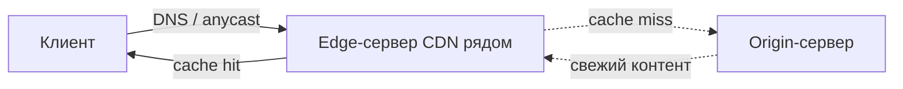

# CDN — сеть доставки контента (Content Delivery Network)

## TL;DR
Географически распределённая сеть кеш-серверов, размещённых **близко к пользователям** (в крупных ISP, IXP, городах). Пользователь, попросивший контент, получает его не от далёкого «origin», а от ближайшего edge-сервера CDN. Снижает задержку, разгружает магистрали, повышает отказоустойчивость.

## Какую проблему решает
Если все запросы за `youtube.com/video.mp4` идут в один дата-центр в США, у пользователя в Индии задержка слишком большая, а магистраль перегружена одинаковыми байтами. Решение: положить **копии** видео ближе к каждому регионе, и направлять пользователя туда. Так появилось CDN — Akamai (1998), Cloudflare, Fastly, Google, Amazon CloudFront, и др.

## Как работает
1. Контент-провайдер (origin) загружает файлы в CDN или CDN сам кэширует «по запросу».
2. Edge-сервера CDN находятся в десятках/сотнях городов.
3. Когда клиент делает запрос, его направляют на ближайший edge — обычно через **DNS** (геолокация по IP клиента/резолвера) или **Anycast** (один IP, маршрутизация в ближайший экземпляр).
4. Edge отдаёт контент из кеша. Cache-miss → fetch у origin → сохранить.

## Пример
Запрашиваешь видео с YouTube:
1. DNS возвращает IP, обслуживаемый Google Edge Network.
2. Подключаешься к узлу в Москве (если ты в России) или в Стокгольме (если в Финляндии).
3. Видео отдаётся оттуда. Origin (DC в США) ты вообще не касаешься.

## Связи
- **Базируется на:** [[Интернет — архитектура]], [[DNS]] (для request routing), [[Anycast]] (один IP — много экземпляров).
- **Используется в:** YouTube, Netflix, Cloudflare-сайты, обновления приложений Apple/Google/Microsoft.
- **Соседи по уровню:** [[Веб-кэширование и прокси]] — частный случай (одиночный кэш).
- **Противопоставляется:** «один origin» — не масштабируется и не справляется со всплесками.

## Подводные камни
- CDN обычно эффективен для **статики**: видео, картинки, JS, шрифты. Динамические ответы (личный кабинет банка) кешировать сложно.
- Cache invalidation — одна из «двух сложных задач CS». Положить в кеш просто; **обновить везде сразу** — нет.
- Концентрация трафика у нескольких CDN означает риск: глобальный сбой Cloudflare/Akamai — широко заметен в интернете.

## Дальше читать
- [[CDN — устройство]] — детали реализации (глава 7).
- [[Веб-кэширование и прокси]] — каноничные приёмы кеширования HTTP.
- [[Anycast]] — низкоуровневая основа request routing.
- Tanenbaum, гл. 1, §1.2.3; гл. 7, §7.5.3 (стр. PDF 37–38, 792+).
