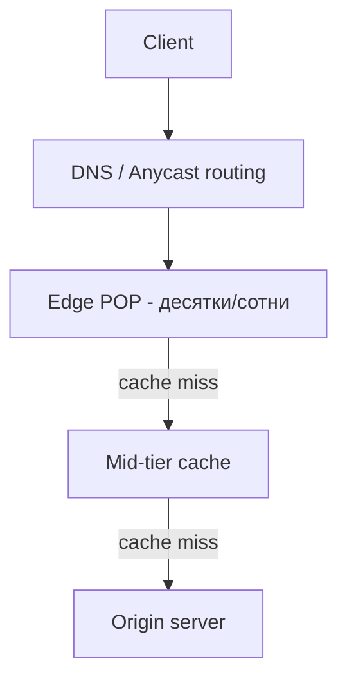

# CDN — устройство

## TL;DR
**Edge-серверы** в десятках/сотнях точек мира → **request routing** (через DNS-geolocation или [[Anycast]]) направляет клиента на ближайший. **Origin pull / push** для синхронизации. **Hierarchical caching** (edge → mid-tier → origin shielding). **Анти-DDoS, WAF, image optimization** — добавочные сервисы. Главные: Akamai, Cloudflare, Fastly, AWS CloudFront, Google Cloud CDN.

## Какую проблему решает
Один origin → миллионы клиентов = bottleneck в bandwidth и latency. CDN распределяет нагрузку и приближает контент к пользователю — снижает RTT и origin-нагрузку.

## Как работает

**Слои:**

**Edge POPs** (Points of Presence):
- Десятки или сотни в крупных городах и IXP.
- Каждый — кластер серверов с большим SSD-cache.
- Точка входа для клиентов в радиусе 10-100 мс.

**Request routing** — как клиент попадает на правильный POP:
- **DNS-based:** CDN держит DNS-сервер для своих доменов. По src IP резолвера определяет географию → возвращает IP ближайшего POP.
- **Anycast-based** ([[Anycast]]): один IP анонсируется из всех POP'ов; BGP сам направляет.
- **GSLB** (Global Server Load Balancing): комбинация — DNS + health-checks + geo-data.

**Cache hierarchy:**
- **Edge:** локальный, маленький, hot-content.
- **Mid-tier:** между edge и origin, помогает «экономить» origin.
- **Origin shield:** один POP «прокладка» перед origin — все edge идут через него, origin видит малый трафик.

**Cache key:** `(URL, Vary-headers, etc.)` — что считать «одной и той же копией».

**Origin protection:**
- **Pull:** edge при cache-miss идёт за content к origin.
- **Push:** content загружается на CDN заранее (при deploy).

**Доп. сервисы:**
- **WAF** (Web Application Firewall) — anti-XSS, anti-SQLi.
- **DDoS-mitigation** — фильтрация нелегитимного трафика.
- **Image/video optimization** — на лету resize, WebP/AVIF.
- **TLS termination** — сертификаты управляются CDN.
- **Edge compute** (Cloudflare Workers, Lambda@Edge) — JS/WASM прямо на edge.

## Пример
**Cloudflare:**
- 300+ POPs в 100+ странах.
- Anycast: один IP `1.1.1.1` или клиентский CNAME → routed to nearest POP.
- При cache-miss → mid-tier → origin (опционально через **Argo Smart Routing**).
- На POP — анти-DDoS-фильтры на пути.

**Netflix Open Connect:**
- Свой CDN с серверами размещёнными внутри ISP'ов.
- Видео-сегменты pre-positioned на этих серверах.
- Снижает межоператорский трафик радикально.

## Связи
- **Базируется на:** [[CDN — сеть доставки контента]] (концепт), [[DNS]], [[Anycast]] (routing), [[Веб-кэширование и прокси]] (механика).
- **Используется в:** все массовые сайты, видео-стриминг, software updates (Apple, Microsoft).
- **Соседи по уровню:** **edge compute platforms** — расширение CDN в compute.
- **Противопоставляется:** один origin без CDN — не масштабируется.

## Подводные камни
- **Cache invalidation** — purge API на CDN для удаления устаревшего. Делает медленные wave purges (несколько секунд глобально).
- **Stale-while-revalidate** — отдавать stale пока обновляем — стандартная практика.
- **CDN concentration risk:** глобальный сбой Cloudflare/Akamai заметен сразу в большой части интернета.
- **TLS vs CDN:** CDN держит **ваши** приватные ключи. Нужно доверие.

## См. также (прикладное)
RF-circumvention: CDN — фронт для VPN.
- [[CDN-фронтинг]] — backend за Cloudflare/CloudFront; classic cross-domain fronting сломан с 2018, но Cloudflare-AS остаётся в whitelist.
- [[Yandex API Gateway фронтинг]] — РФ-облачный аналог в trusted-AS.
- [[applied-rf-status]] — обзор техник.

## Дальше читать
- [[CDN — сеть доставки контента]] — концепт.
- [[Anycast]] — routing.
- [[Веб-кэширование и прокси]] — механика.
- Tanenbaum, гл. 7, §7.5.3 (стр. PDF 792–797).
