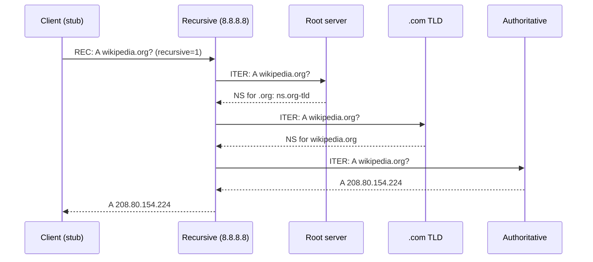

# DNS — рекурсивный vs итеративный запрос

## TL;DR
**Рекурсивный** запрос (от клиента к recursive resolver, например 8.8.8.8): «дай мне ответ; ходи везде сам». **Итеративный** запрос (от recursive resolver к authoritative): «дай мне или ответ, или указатель куда идти дальше». Стэк: **stub → recursive → много iterations → ответ**.

## Какую проблему решает
DNS — иерархическая система. Клиент не должен сам ходить по корневым/TLD/auth — это сложно и медленно. Recursive resolver делает это за него. Между recursive и серверами высокого уровня — итеративные шаги, чтобы не нагружать корни full-recursive-задачами.

## Как работает

**Стэк типичного запроса:**

**Recursive resolver:**
- Принимает recursive query от клиента.
- Делает iterative queries вверх по иерархии.
- Кеширует ответы.
- Возвращает финальный ответ клиенту.

**Authoritative server:**
- НЕ делает recursive (обычно).
- Отвечает только по своей зоне или referrals (NS-записи делегата).

**Public recursives:**
- 8.8.8.8 / 8.8.4.4 — Google
- 1.1.1.1 / 1.0.0.1 — Cloudflare
- 9.9.9.9 — Quad9 (с фильтрацией malware)

## Пример
**Linux на ноуте:**
1. `ping wikipedia.org`
2. **glibc resolver** (stub) читает /etc/resolv.conf → recursive 192.168.1.1 (домашний роутер).
3. Роутер форвардит на 8.8.8.8.
4. 8.8.8.8 если в кэше — отдаёт; иначе делает iterations.
5. Ответ кэшируется на каждом уровне, возвращается клиенту.

## Связи
- **Базируется на:** [[DNS]] (общий контекст).
- **Используется в:** все DNS-разрешения; [[DNS — кэширование и TTL]] (важно для работы recursive'ов).
- **Соседи по уровню:** **DNS-stub-resolver** (клиентская библиотека).
- **Противопоставляется:** «всё recursive» — корни были бы перегружены.

## Подводные камни
- **Open recursive resolver** на публичном IP — DDoS-amplifier. Запрос из 50 байт может вернуть 5 КБ → 100x amplification. Соблюдать **rate limit** или закрыть recursion для чужих.
- **Resolver outage** обрывает интернет: всё перестаёт работать, хотя сами ресурсы доступны. Поэтому несколько resolver'ов в /etc/resolv.conf.
- В **DoH/DoT** клиенты обходят локальные resolver'ы провайдеров и шлют напрямую на 1.1.1.1 — это политически спорно.

## Дальше читать
- [[DNS — кэширование и TTL]] — почему recursive экономен.
- [[DNS over HTTPS / TLS]] — современная защита.
- Tanenbaum, гл. 7, §7.1.5 (стр. PDF 699–701).
