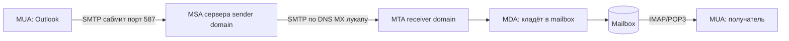

# Email — архитектура

## TL;DR
Цепочка из 4 ролей: **MUA** (Mail User Agent — клиент: Outlook, Gmail-web, Thunderbird), **MSA** (Submission Agent — приёмник от MUA), **MTA** (Mail Transfer Agent — серверы между домены, по SMTP), **MDA** (Mail Delivery Agent — кладёт в mailbox получателя). Получатель забирает через **POP3** (скачать и удалить) или **IMAP** (синхронизация на сервере).

## Какую проблему решает
Asynchronous communication — отправитель и получатель **не должны быть онлайн одновременно**. Сообщение хранится на серверах, забирается, когда удобно. Email требует распределённой инфраструктуры: домены работают независимо, передают друг другу.

## Как работает

**Шаги:**
1. **MUA → MSA** (submission): пользователь нажимает «отправить». MUA шлёт по SMTP на 587 (с auth) или 465 (TLS).
2. **MSA → MTA назначения** (relay): MSA находит MX-запись домена получателя через DNS, шлёт через SMTP на 25.
3. **MTA → MDA**: получатель-MTA принимает, передаёт MDA для записи в mailbox.
4. **MDA → mailbox**: запись в файловую систему/БД.
5. **MUA получателя ↔ Mailbox** через IMAP (synchronization) или POP3 (download).

**Аутентификация и спам-защита:**
- **SPF** (TXT-запись): «вот эти IP имеют право слать почту от моего домена».
- **DKIM** (TXT-запись): криптографическая подпись от домена.
- **DMARC** (TXT-запись): policy «что делать с письмами, которые не прошли SPF/DKIM».

## Пример
**Алиса (alice@example.com) → Боб (bob@gmail.com):**
1. Алиса в Outlook → SMTP submit на mail.example.com:587, AUTH с паролем.
2. mail.example.com (MSA) делает DNS-lookup MX gmail.com → gmail-smtp-in.l.google.com.
3. SMTP на gmail-smtp-in:25, передаёт письмо.
4. Google: проверка SPF (IP example.com в списке?), DKIM (подпись валидна?), DMARC.
5. MDA Google → mailbox bob@.
6. Боб открывает Gmail — IMAP синхронизация.

## Связи
- **Базируется на:** [[Транспортный уровень]] (TCP), DNS MX-записи.
- **Используется в:** [[SMTP]], [[IMAP и POP3]], [[MIME]] — каждый протокол со своей функцией.
- **Соседи по уровню:** [[PGP и S/MIME]] — end-to-end шифрование почты.
- **Противопоставляется:** мессенджеры (синхронные, real-time) — email асинхронный.

## Подводные камни
- **Open relay** (старый, без auth) → спам-проблема. Современные MTA закрыты.
- **MX-fallback:** несколько MX с priority — если основной недоступен, идти на резервный.
- **SPF break при forwarding:** если письмо переслано с другого домена, SPF исходного домена не пройдёт. Помогает **SRS** (Sender Rewriting Scheme).

## Дальше читать
- [[SMTP]] — главный протокол передачи.
- [[IMAP и POP3]] — забор клиентом.
- Tanenbaum, гл. 7, §7.2.1 (стр. PDF 706–708).
