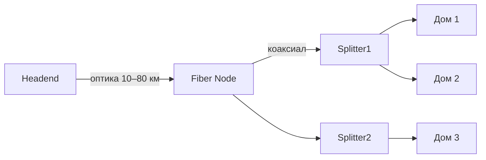

# HFC — гибридная сеть (Hybrid Fiber-Coaxial)

## TL;DR
Архитектура кабельных сетей: от провайдерского центра (**headend** — головная станция) → **оптика до квартала** → **коаксиал к домам**. Оптика тянет много услуг на большие расстояния, коаксиал делает «последнюю милю» дёшево, используя уже проложенную инфраструктуру кабельного ТВ. На этой среде работает [[DOCSIS]].

**Аналогия с водопроводом:** магистральная труба (оптика) идёт через город до района, потом тонкие трубы (коаксиал) разводят по подъездам. Главный «насос» (headend) — у провайдера в центре города.

## Какую проблему решает
Чисто коаксиальные сети (классическое кабельное ТВ) не масштабировались до интернета: коаксиал быстро затухает на длинных дистанциях, нужны частые усилители, шум накапливается. Тянуть оптику в каждый дом — дорого. HFC — компромисс: **оптика до узла, коаксиал только в районе** — даёт большую полосу и сохраняет инвестиции в существующий коаксиал.

## Как работает

**Иерархия:**
1. **Headend** (головная станция) — собирает контент (ТВ-каналы) и интернет-аплинк, передаёт в оптику.
2. **Fiber node** (квартальный узел) — конвертирует оптический сигнал в электрический.
3. **Coax tree** — коаксиал расходится по кварталу к подключённым домам через сплиттеры/усилители.
4. **Cable modem** в доме принимает сигнал, превращает в Ethernet.

**Двунаправленность:** в HFC канал асимметричен. Downstream (к абонентам) — широкая полоса, классически **54–550 МГц** (по Tanenbaum, стр. 210), современные сети расширены до 750 МГц и выше. Upstream (от абонентов) — узкая, 5–42 МГц (US) / чуть шире в Европе. Поэтому DOCSIS-скорости асимметричны.

**Shared medium:** все дома, висящие на одном fiber node, **делят** одну коаксиальную «дорогу». В часы пик скорость падает у всех соседей одновременно.

## Пример
- **Микрорайон, ~500 квартир:** один fiber node, коаксиал расходится через 2–3 уровня сплиттеров.
- **Полоса downstream:** 800 МГц на узле; на канал DOCSIS — 6 МГц (US) или 8 МГц (EU); сотня каналов параллельно.
- **Реальная скорость:** 200–500 Мбит/с в спокойные часы, падает к 50 Мбит/с в час пик.

## Связи
- **Базируется на:** [[Оптоволокно]] (магистраль), [[Коаксиальный кабель]] (последняя миля).
- **Используется в:** [[DOCSIS]] — стандарт интернета поверх HFC.
- **Соседи по уровню:** GPON/FTTH — оптика прямо в дом, без коаксиала; ADSL — медь без оптики до узла.
- **Противопоставляется:** «оптика в каждый дом» — лучше по характеристикам, но дороже за капекс. HFC — переходная архитектура.

## Подводные камни
- Shared medium: твоя скорость зависит от соседей. Это не обман провайдера, это физика HFC.
- Коаксиал чувствителен к **upstream-помехам** — старые телевизоры, плохие фильтры в подъездах могут «забивать» upstream-канал.
- Эволюция HFC → FTTH идёт постепенно: операторы либо тянут оптику глубже (ставят узел на дом), либо переходят на чистую оптику. **Fiber Deep** — стратегия, при которой узел придвигается всё ближе к домам.

## Дальше читать
- [[DOCSIS]] — что бегает по HFC.
- [[Сети широкополосного доступа]] — место HFC в общей картине.
- Tanenbaum, гл. 2, §2.7 (стр. PDF 207–214).
