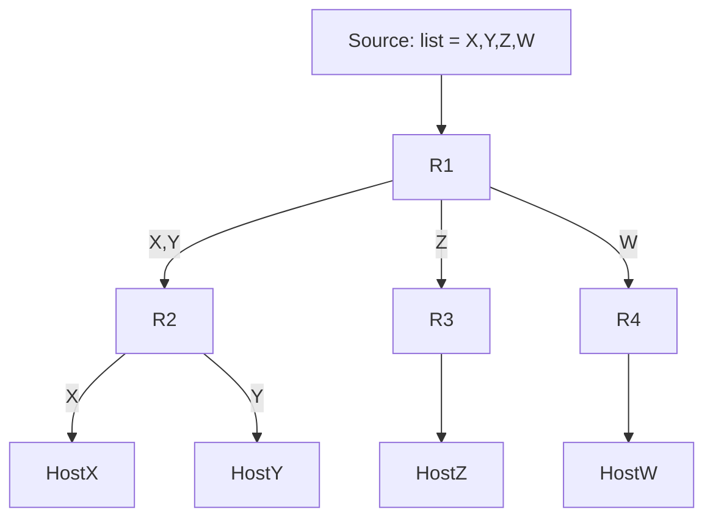

# Multidestination routing

## TL;DR
Один из 4 классических методов **broadcast** в сетях (по Tanenbaum, §5.2.7). Каждый пакет содержит **список или битовую карту получателей**. Маршрутизатор разбирает список, **разделяет** его по выходным интерфейсам, шлёт копию (с подмножеством list'а) в каждый. На каждом hop'е список сокращается. Не требует state в маршрутизаторе. Проигрывает [[Reverse Path Forwarding]] и multicast trees, но прост и работал в ARPANET.

## Какую проблему решает
[[Лавинная маршрутизация]] **дублирует** пакет везде — overhead. **Spanning-tree based** требует pre-built tree. Multidestination — middle ground: пакет **знает**, кому он нужен, и маршрутизатор разделяет работу.

## Как работает

**Структура пакета:**
- Заголовок + **список destinations** (или битовая карта).
- Payload.

**На маршрутизаторе:**
1. Получил пакет с listом получателей D = {D1, D2, ..., Dn}.
2. Для каждого D_i смотрит свою routing table → выходной интерфейс I_i.
3. **Группирует** destinations по выходному интерфейсу.
4. **Один пакет с подмножеством list'а** идёт в каждый интерфейс.

**Пример:**
- Маршрутизатор имеет 3 интерфейса A, B, C.
- Получает packet с D = {X, Y, Z, W}.
- Lookup: X → A, Y → A, Z → B, W → C.
- Шлёт:
  - В A: packet с D = {X, Y}.
  - В B: packet с D = {Z}.
  - В C: packet с D = {W}.

На следующем hop'е каждый packet ещё разделится → итог: каждый D получает свою копию.

## Пример
**Исторический ARPANET broadcast:**
- Mail в множество мест → packet с list получателей.
- Каждый IMP разбирал и форвардил по соответствующим линиям.

**Сегодня:** редко используется напрямую. Концепт жив в:
- **Source routing** (RFC 791) — отправитель указывает path в заголовке.
- **MPLS-multicast** в современных провайдерах.
- **NSH** (Network Service Header) для service-chaining.

## Связи
- **Базируется на:** [[Multicast routing]] (общая категория), [[Лавинная маршрутизация]] (альтернативный метод).
- **Используется в:** historical ARPANET; концептуально в source-routing, MPLS-multicast.
- **Соседи по уровню:** [[Reverse Path Forwarding]] — современный multicast-метод; spanning-tree multicast.
- **Противопоставляется:** broadcast (всем без выбора) — overkill; unicast (по одному) — лишние копии в магистрали.

## Подводные камни
- **Размер заголовка** растёт с числом destinations — на больших списках overhead значителен.
- **Нет multicast group abstraction** — отправитель должен знать **всех** получателей. В IP-multicast же группа абстракция (any host can join).
- **Source routing** уязвимо security-wise (атакующий может подделать path).

## Дальше читать
- [[Multicast routing]] — современный подход.
- [[Reverse Path Forwarding]].
- Tanenbaum, гл. 5, §5.2.7 (стр. PDF 438–439).
