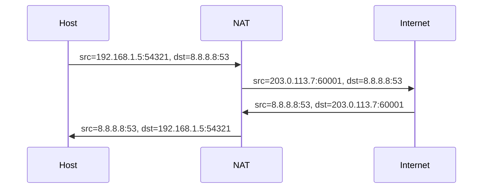

# NAT — Network Address Translation

## TL;DR
**Костыль** для дефицита IPv4-адресов: за одним публичным IP скрывается **много частных хостов**. NAT-устройство (типичный домашний роутер) переписывает src-IP исходящих пакетов на свой публичный IP + меняет src-port, запоминает mapping в таблице. Входящие ответы переадресуются обратно нужному хосту по mapping'у. Без NAT IPv4-интернет не пережил бы 2010-е.

## Какую проблему решает
IPv4 = 4.3 млрд адресов; в мире намного больше устройств. Полный переход на IPv6 затянулся. NAT позволил миллиарду устройств жить за единственными публичными IP (один на каждый дом/офис). Технически не идеально (ломает end-to-end-принцип), но работает.

## Как работает

**Самая частая разновидность — PAT (Port Address Translation)**, она же **NAT-overloading**:

1. Хост 192.168.1.5:54321 шлёт пакет к 8.8.8.8:53.
2. NAT-роутер видит исходящий, заменяет src на (свой публичный IP, например, 203.0.113.7, и **новый** src-port 60001).
3. В **NAT-таблицу** добавляет: `(192.168.1.5:54321, 8.8.8.8:53) ↔ (203.0.113.7:60001, 8.8.8.8:53)`.
4. Пакет уходит в интернет с публичными адресами/портами.
5. Ответ от 8.8.8.8:53 → 203.0.113.7:60001.
6. NAT находит mapping → переписывает dst → 192.168.1.5:54321 → отдаёт хосту.

**Mapping живёт по таймеру** (TCP keepalive, UDP — короче).

**Виды NAT (по Cone classification):**
- **Full cone** — внешний IP/port открыт для любых внешних src.
- **Restricted cone** — открыт для тех, к кому хост уже обращался.
- **Port-restricted cone** — то же, но с учётом порта.
- **Symmetric** — для каждого dest свой src-port. **Hardest для P2P.**

## Пример
**Дом с 5 устройствами:**
- Все за одним публичным IP `203.0.113.7`.
- Телефон, ноут, ТВ, IoT, гостевой ноут — каждое имеет свой 192.168.1.x.
- NAT-таблица в роутере держит активные сессии всех.
- Роутер при сбое теряет таблицу → все TCP-сессии рвутся.

**P2P за NAT:** проблема. Решения — STUN, TURN, ICE; UPnP/PCP для проброса портов; **hole punching** для UDP.

## Связи
- **Базируется на:** [[IP-адресация и CIDR]] (private-пространство RFC 1918), [[TCP]] / [[UDP]] (для PAT нужны порты).
- **Используется в:** все домашние и большинство корпоративных интернет-подключений; **Carrier-Grade NAT (CGN)** у операторов.
- **Соседи по уровню:** **firewall** — обычно совмещён с NAT.
- **Противопоставляется:** [[IPv6]] — без NAT, прямой end-to-end. Но реальность — NAT и в IPv6 (NAT66) для приватности.

## Подводные камни
- **Ломает end-to-end argument:** хост 192.168.1.5 невидим извне без явного port forwarding'а.
- **Протоколы со встроенным IP в payload** (FTP, SIP, H.323) ломаются — NAT не знает, что там переписать. Нужны **ALG (Application-Level Gateway)**.
- **CGN** (carrier-grade) у мобильных операторов прячет тысячи абонентов за одним публичным IP — сильно усложняет attribution и port-forwarding.
- В IPv6 NAT почти не нужен (адресов хватает), но иногда используется для **приватности** или **легаси-гибкости**.

## См. также (прикладное)
RF-circumvention: CGN играет роль маркера ТСПУ-карты на mobile-сетях.
- В диагностике [[PB4 — диагностика whitelist]] узел `198.18.x.x` или `100.64.x.x` в `traceroute` — обычный признак ТСПУ или CGN-оператора.
- [[TURN-relay]] — обходит symmetric-NAT для WebRTC-туннеля.
- [[WebRTC-туннель]] — хорошо работает за CGN.
- [[applied-rf-status]] — обзор техник.

## Дальше читать
- [[IPv4]], [[IP-адресация и CIDR]] — где жить без NAT.
- [[IPv6]] — будущее без NAT (в идеале).
- Tanenbaum, гл. 5, §5.7.2 (стр. PDF 515–519).
