# NAV — Network Allocation Vector

## TL;DR
**Виртуальный** carrier sensing в Wi-Fi. Каждый 802.11-фрейм содержит поле **Duration** — сколько ещё мс канал «занят» этой передачей и её ACK'ом. Все, кто слышат фрейм, ставят локальный таймер NAV на это время → считают канал занятым, даже если **физически** ничего не слышат. Дополняет физический carrier sensing.

## Какую проблему решает
Чисто **физический** carrier sensing уязвим к [[Hidden terminal problem]]: узел не слышит передачу, считает канал свободным, начинает свою — у получателя коллизия. NAV решает это **информационно**: достаточно один раз услышать фрейм с Duration — и узел знает, на сколько канал зарезервирован, не нуждаясь слышать саму передачу.

## Как работает

**Поле Duration:** в заголовке 802.11-фрейма 2 байта = до 32767 мкс резервации.

**Схема обновления NAV:**
1. Узел получает любой фрейм (data, RTS, CTS, ACK).
2. Читает Duration.
3. **NAV = max(NAV, current_time + Duration)** — ставит таймер.
4. Пока NAV > current_time, узел считает канал занятым (даже если физически слышимая передача уже закончилась).

**Используется и в RTS/CTS, и в data-фреймах:**
- В RTS Duration = время CTS + SIFS + Data + SIFS + ACK.
- В CTS Duration = время Data + SIFS + ACK (минус то, что уже прошло).
- В Data Duration = время следующих фрагментов и ACK (для фрагментированных передач).

**Полный carrier sensing = физический OR виртуальный:**
- Физический: антенна слышит сигнал.
- Виртуальный: NAV > 0.
- **Любой из них активен** → канал считается занятым.

```mermaid
gantt
  title Эфир, NAV-таймер у hidden узла
  dateFormat ss
  Услышал CTS :01, 1
  NAV занят :crit, 02, 5
  NAV истёк :07, 1
  Можно передавать :08, 1
```

## Пример
**A передаёт длинный файл к AP, C — hidden от A но слышит AP:**
- C получил CTS от AP с Duration = 5 мс.
- C ставит NAV = now + 5 мс.
- В течение 5 мс C не пытается передать, даже если ничего физически не слышит.
- NAV истёк → C может попытаться, если канал и физически свободен.

**Без NAV** C бы попробовал передать — у AP коллизия с передачей A.

## Связи
- **Базируется на:** [[802.11 MAC — DCF]] (живёт внутри DCF), [[CSMA/CA]] (виртуальный CS — компонент CA-протокола).
- **Используется в:** [[RTS/CTS]] (CTS обновляет NAV у hidden-узлов), любая 802.11-передача.
- **Соседи по уровню:** [[Hidden terminal problem]] — главный сценарий, ради которого NAV нужен; физический carrier sensing (CCA — Clear Channel Assessment) — пара к виртуальному.
- **Противопоставляется:** «только физический CS» — недостаточен в hidden-terminal сценариях.

## Подводные камни
- NAV — **доверие** к Duration в чужом фрейме. Атакующий может слать фреймы с большим Duration, парализуя соседнюю BSS — DoS-атака.
- При плохом сигнале NAV может «зависнуть» — узел упрямо считает канал занятым, хотя передача уже закончилась с ошибкой. В стандарте есть механизмы reset NAV.
- NAV не идентифицирует **кто** передаёт — только сколько ждать. Узел не знает, на каком канале или в каком направлении идёт передача — для него это просто «ждать N мкс».

## Дальше читать
- [[RTS/CTS]] — главный потребитель NAV.
- [[802.11 MAC — DCF]] — общий контекст.
- Tanenbaum, гл. 4, §4.4.3 (стр. PDF 366).
