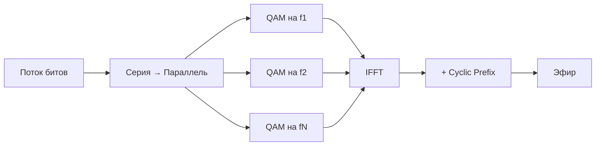

# OFDM (Orthogonal Frequency Division Multiplexing)

## TL;DR
Делит широкий канал на **сотни или тысячи** узких поднесущих (subcarriers), которые выбраны **ортогональными** — их сигналы не мешают друг другу математически, без защитных интервалов. На каждой поднесущей — независимая [[Цифровая модуляция — амплитуда-частота-фаза|QAM-модуляция]]. Получили: высокую спектральную эффективность, устойчивость к многолучевому замиранию, основу всех современных беспроводных систем.

## Какую проблему решает
В одной широкополосной несущей **многолучевое замирание** (сигнал доходит несколькими путями с разными задержками) ломает символы — соседние биты накладываются (ISI — intersymbol interference). На быстрых модуляциях это убивает связь.

OFDM делит полосу на множество узких. На каждой поднесущей символ длинный (узкий канал → меньше требований к временной точности), эхо успевает «затухнуть» в защитном интервале (cyclic prefix) — приёмник видит чистый сигнал. **Многолучевость** превращается из врага в **ресурс** (можно усреднять).

## Как работает

1. **Поток данных делится** на N подпотоков.
2. Каждый подпоток модулируется на свою поднесущую через QAM/PSK.
3. **Ортогональность** означает: интервал между поднесущими равен 1/T, где T — длительность символа. На частоте одной поднесущей все остальные имеют ноль — взаимного влияния нет.
4. **IFFT** (обратное преобразование Фурье) делает это эффективно — собирает все поднесущие в единый сигнал.
5. **Cyclic prefix** — копия конца символа в начало; служит защитным интервалом против эха.
6. Передача → канал → FFT на приёме → демодуляция каждой поднесущей.

**OFDMA** (Orthogonal Frequency Division Multiple Access) — расширение OFDM на **множество пользователей**: разные поднесущие или группы (resource blocks) выделяются разным абонентам в одно время. Так делает LTE, 5G, Wi-Fi 6.

## Пример
- **Wi-Fi 5 (802.11ac):** OFDM на 80 МГц, 234 поднесущих, 256-QAM, 1 пространственный поток → ~390 Мбит/с.
- **Wi-Fi 6 (802.11ax):** OFDMA, 1024-QAM, до 9.6 Гбит/с с MIMO.
- **LTE:** OFDMA в downlink, SC-FDMA в uplink (для энергоэффективности телефона).
- **5G NR:** OFDM с гибким параметром поднесущей (15/30/60/120 кГц) для разных сценариев (мобильность, mMTC, mmWave).
- **ADSL:** DMT (Discrete MultiTone) — практически OFDM на 4 кГц-поднесущих в полосе 1.1 МГц.
- **DOCSIS 3.1:** OFDM на 192 МГц-каналах с 4096-QAM.

## Связи
- **Базируется на:** [[Мультиплексирование]] (важнейший частный случай FDM), [[Цифровая модуляция — амплитуда-частота-фаза]] (на каждой поднесущей).
- **Используется в:** [[Wi-Fi — обзор]] (с 802.11a), [[Поколения сотовой связи 1G–5G]] (4G/5G), [[ADSL]] (DMT), [[DOCSIS]] (3.1+).
- **Соседи по уровню:** SC-FDMA (одна несущая с FFT-предкодированием — для uplink LTE).
- **Противопоставляется:** одна широкополосная несущая (single-carrier) — проще, но уязвима к многолучёвке.

## Подводные камни
- **Высокая PAPR** (peak-to-average power ratio): сумма многих поднесущих может дать большие пики → требует линейного усилителя, плохо для энергии телефона. Поэтому в LTE-uplink берут SC-FDMA.
- **Чувствительность к частотному смещению:** небольшой уход частоты приёмника ломает ортогональность.
- OFDM сложнее реализовать, чем простую модуляцию; стало возможным благодаря дешёвой DSP в начале 2000-х.

## Дальше читать
- [[Мультиплексирование]] — общее семейство.
- [[Wi-Fi — обзор]] — главный потребитель.
- Tanenbaum, гл. 2, §2.4.4 (стр. PDF 158–166).
