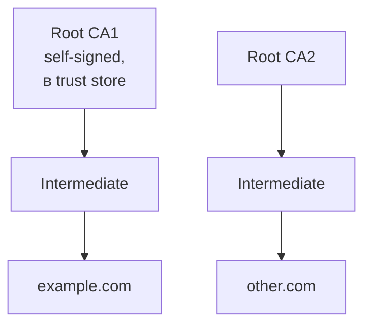

# PKI — Public Key Infrastructure

## TL;DR
Иерархия **CA** (Certificate Authorities), выпускающих, обновляющих и **отзывающих** X.509-сертификаты. Корневые CA в **trust store** ОС/браузера → доверие распространяется через intermediate CA до leaf-сертификатов. Revocation: **CRL** (списки), **OCSP** (онлайн-запросы), **OCSP Stapling**. Главные публичные CA: Let's Encrypt, DigiCert, GlobalSign.

## Какую проблему решает
Один X.509-сертификат сам по себе — это просто данные с подписью. Откуда **доверие**? Если бы все CA были random, любой мог бы подписать сертификат example.com. PKI организует **иерархию**: trusted root CA (audited, в trust store) подписывают intermediate, те — leaf. Браузер проверяет цепочку.

## Как работает

**Иерархия:**

**Trust store:**
- Браузер/ОС включает ~100-200 root CA.
- Mozilla, Apple, Microsoft, Google управляют своими.
- Включение в trust store — годы проверки CA на security/audit.

**Жизненный цикл cert:**
1. **Domain owner** генерирует key pair, делает **CSR** (Certificate Signing Request).
2. Отправляет в CA.
3. **CA проверяет** ownership домена (DV — Domain Validation: HTTP-01 challenge, DNS-01; OV/EV — ручная проверка организации).
4. CA подписывает cert.
5. Owner устанавливает на сервер.
6. Через ~90 дней (Let's Encrypt) или 1 год (commercial) — **renewal**.
7. При компрометации — **revocation**.

**Revocation:**
- **CRL** (Certificate Revocation List): CA публикует list of revoked serials. Скачивается клиентом, проверяется. **Медленно** обновляется.
- **OCSP** (Online Certificate Status Protocol, RFC 6960): real-time запрос «is this cert revoked?». Privacy concern: CA знает, что клиент посещает сайт.
- **OCSP Stapling:** сервер сам периодически запрашивает OCSP-ответ и **прикладывает** к TLS-handshake. Privacy ок.
- **Short-lived certs** (LE 90 days) — фактическое решение revocation: если cert компрометирован, скоро истечёт сам.

**Validation levels:**
- **DV** (Domain Validated): только владение домена. Дёшево, автоматически (Let's Encrypt).
- **OV** (Organization Validated): + проверка организации.
- **EV** (Extended Validation): глубокая проверка, был «зелёный bar» в браузерах (now deprecated).

## Пример
**Let's Encrypt — революция (2015+):**
- Free, automated DV.
- 90-day certs forced renewal через automation (certbot, ACME).
- Massively democratized HTTPS — большая часть веба.

**Certificate Transparency (CT):**
- Все cert публикуются в публичных logs → детектирование misissuance.
- Браузеры требуют SCT (Signed Certificate Timestamp) в cert.

## Связи
- **Базируется на:** [[X.509 сертификаты]] (формат), [[Цифровая подпись]] (механизм).
- **Используется в:** [[TLS — рукопожатие]] (HTTPS), code signing, S/MIME.
- **Соседи по уровню:** **PGP web of trust** — альтернативная модель без центральных CA.
- **Противопоставляется:** self-signed — не доверенно.

## Подводные камни
- **CA compromise** — серьёзный инцидент: Diginotar (2011) — взлом CA → выпуск fake certs для google.com. CA удалён из trust store, обанкротилась.
- **Trust on First Use (TOFU)** — альтернативная модель (SSH); PKI же даёт доверие с первого раза.
- **Russian root CA** (2022) — попытка self-CA для российского интернета после санкций; не в международных trust stores.
- **Quantum threat:** все signatures в PKI используют RSA/ECDSA → надо мигрировать на ML-DSA в ближайшем десятилетии.

## Дальше читать
- [[X.509 сертификаты]] — формат.
- [[TLS — рукопожатие]] — главный пользователь.
- Tanenbaum, гл. 8, §8.8.3 (стр. PDF 892–895).
