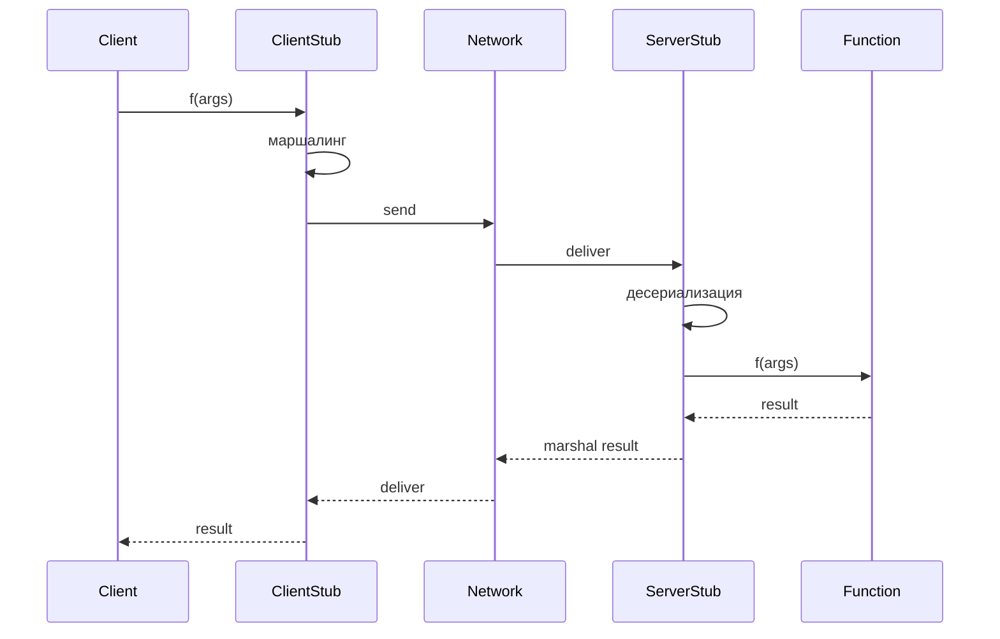

# RPC — Remote Procedure Call

## TL;DR
Парадигма: **«удалённый вызов выглядит как локальный»**. Клиент вызывает функцию `result = f(args)`; под капотом — **маршалинг** аргументов в сообщение, отправка, **stub** на сервере вызывает реальную функцию, ответ возвращается обратно. Скрывает сетевые детали от программиста. Реализации: SunRPC (1984), CORBA, .NET Remoting, **gRPC** (Google, 2015), Thrift (Facebook), JSON-RPC.

## Какую проблему решает
Программист хочет писать «бизнес-логику», а не возиться с сокетами/сериализацией/таймаутами. RPC даёт **прозрачную абстракцию**: «функция как функция, что она ушла на сервер — деталь». Снижает порог вхождения для распределённых систем.

## Как работает

**Компоненты:**
1. **Client stub** — генерирует код на клиенте, выглядит как обычная функция.
2. **Server stub** — на сервере, принимает вызов, разбирает аргументы, зовёт реальную реализацию.
3. **Serialization / маршалинг** — конвертация аргументов в байты (JSON, Protobuf, Thrift, XDR).
4. **Транспорт** — TCP, HTTP/2 (gRPC), UDP, message queue.

**Семантики при сбоях:**
- **At-most-once:** не повторять. Если ответ не пришёл — неизвестно, выполнилось ли. Безопасно для **non-idempotent** (платежи).
- **At-least-once:** повторять при таймауте. Безопасно для **идемпотентных** (GET).
- **Exactly-once:** требует распределённых транзакций — сложно, редко.

**Идеомпотентность:** операция, повторение которой даёт тот же результат. RPC любит идемпотентные операции — упрощает retry.

## Пример
- **gRPC** (Google): generates stubs из `.proto` (Protobuf-определение), бегает по HTTP/2, поддерживает streaming, deadline, cancellation.
- **JSON-RPC**: текстовый, простой, поверх HTTP.
- **REST** — это **не** RPC (по идее resource-oriented), но на практике многие REST-API выглядят как RPC.
- **gRPC в Kubernetes:** все компоненты (kube-apiserver, kubelet, etcd) общаются через gRPC.

## Связи
- **Базируется на:** [[Сокеты Беркли]] (низкий уровень), [[TCP]] / [[UDP]] / [[QUIC]] (transport), сериализация (Protobuf, JSON, Thrift).
- **Используется в:** микросервисы, API между сервисами, Kubernetes, etcd, Cassandra; [[gRPC]] (Google).
- **Соседи по уровню:** [[Восстановление после сбоев]] (idempotency для retry-safety); REST, GraphQL, message queues — альтернативные парадигмы.
- **Противопоставляется:** «прямой socket-код» — низкоуровневый, гибкий, но трудоёмкий; [[HTTP]] REST — другая модель (resource-oriented).

## Подводные камни
- **Сетевая задержка ≠ локальный вызов** — RPC скрывает это, но абстракция протекает: timeout, retry, partial failures. Программа должна это учитывать.
- **Versioning:** добавил поле в Protobuf — старые клиенты должны это пережить (Protobuf хорошо это решает; JSON-RPC — нет).
- **Idempotence** — критично для retry. Платёж, выполняемый «at-least-once» без идемпотентности → двойное списание.

## Дальше читать
- [[TCP]], [[Сокеты Беркли]] — базис.
- Tanenbaum, гл. 6, §6.4.2 (стр. PDF 613–616).
