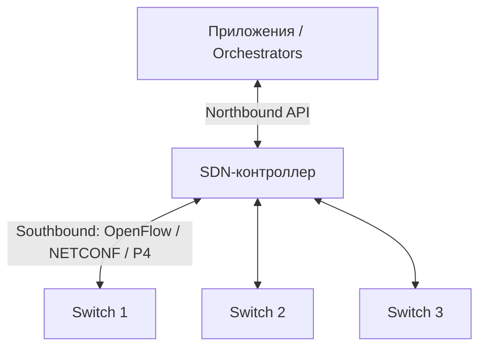

# SDN — программно-конфигурируемые сети

## TL;DR
Архитектурный подход: **отделить control plane** (логика принятия решений, кому какой next-hop) **от data plane** (быстрая пересылка пакетов). Control plane становится **централизованным программным контроллером**; data plane — программируемое железо (switch'и) с простыми таблицами потоков. Через стандартный протокол ([[OpenFlow]]) контроллер ставит правила на switch'и. Идея 2008+, подхвачена операторами и DC.

## Какую проблему решает
Традиционный маршрутизатор — это **vertical box**: control plane (BGP/OSPF/STP) + data plane (forwarding ASIC) + management (CLI). Изменения в control plane — обновление прошивки железа. Сложно вводить новые протоколы и политики, особенно поверх legacy-сетей разных вендоров.

SDN: **выньте control plane наружу** в общий программный контроллер. Тогда:
- Один контроллер управляет 1000+ switch'ей единообразно.
- Новые политики и алгоритмы — это **программа**, не прошивка.
- Простой open-stand железо: «принял пакет, выполни правило таблицы, отправь».

## Как работает

**Три уровня SDN-стека:**

1. **Application plane:** business-логика — Network OS, pipeline'ы, оркестраторы, network virtualization (например, OpenStack Neutron, Kubernetes CNI).
2. **Control plane:** **SDN-контроллер** (ONOS, OpenDaylight, Ryu, Floodlight) — централизованная программная сущность, держащая глобальную картину сети и принимающая решения.
3. **Data plane:** **программируемые** switch'и/routers, поддерживающие протокол управления (например, OpenFlow или P4).

**Между уровнями — API:**
- **Northbound API:** между приложениями и контроллером (REST, gRPC).
- **Southbound API:** между контроллером и data plane ([[OpenFlow]], NETCONF, gNMI, P4Runtime).

**Логически централизованное, физически распределённое** — контроллер часто это **кластер**, но виден приложениям как один.

## Пример
- **Google B4** (внутренняя сеть DC↔DC): SDN-контроллер планирует маршруты с учётом business-приоритетов и реальной нагрузки. Утилизация магистральных каналов выросла с ~30% до ~95%.
- **VMware NSX, Open vSwitch + OVN:** программная сеть для виртуальных машин с микро-сегментацией.
- **5G core (3GPP):** разделение control / user plane (CUPS) — то же SDN-видение для мобильных сетей.
- **Cloud VPC** (AWS, GCP): под капотом — SDN, конфигурируемый API.

## Связи
- **Базируется на:** [[Сетевой уровень]] (где SDN живёт), [[Маршрутизатор]] (его «расщепление»).
- **Используется в:** [[OpenFlow]] (главный southbound-протокол), DC-сети, telco core.
- **Соседи по уровню:** **NFV** (Network Functions Virtualization) — родственная идея: сетевые функции (firewall, LB) как ПО на стандартном железе.
- **Противопоставляется:** **legacy distributed control** — каждый switch со своим BGP/OSPF/STP, без центрального видения.

## Подводные камни
- «**Логически централизованное**» — миф упрощения: контроллер реально это **высокодоступный кластер** с распределённым консенсусом, синхронизацией state, fail-over.
- В крупных сетях разворачивают **гибрид**: SDN для overlay (VXLAN, BGP-EVPN) + classical L3 для underlay.
- **Vendor lock-in** возможен и в SDN — proprietary controller ↔ proprietary switch.
- В **публичном интернете** SDN не используется по политическим причинам — нет общего контроллера для всех AS, BGP остаётся.

## Дальше читать
- [[OpenFlow]] — главный протокол.
- Tanenbaum, гл. 5, §5.6 (стр. PDF 492–499).
