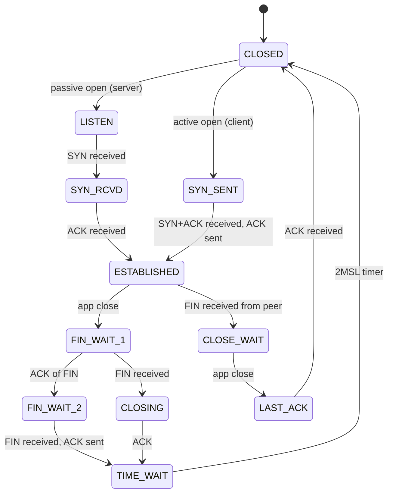

# TCP — состояния (state machine, RFC 9293)

## TL;DR
TCP-соединение — это **конечный автомат** в ОС каждой стороны. 11 состояний: **CLOSED**, **LISTEN**, **SYN_SENT/RCVD**, **ESTABLISHED**, **FIN_WAIT_1/2**, **CLOSE_WAIT**, **CLOSING**, **LAST_ACK**, **TIME_WAIT**. Переходы — на основе входящих сегментов и app-вызовов. Понимание состояний — основа отладки сетевых проблем.

## Какую проблему решает
TCP реализует сложную логику открытия/закрытия с защитой от потерь, дублей, race conditions. Без формального автомата эту логику не отладить. State machine — стандартное представление, понятное всем разработчикам и используемое в RFC.

## Как работает



**Главные состояния и что значат:**

| Состояние | Кто | Что значит |
|---|---|---|
| **LISTEN** | сервер | passive open, ждём SYN |
| **SYN_SENT** | клиент | послали SYN, ждём SYN-ACK |
| **SYN_RCVD** | сервер | получили SYN, послали SYN-ACK, ждём ACK |
| **ESTABLISHED** | оба | соединение установлено, шлём данные |
| **FIN_WAIT_1** | initiator close | послали FIN, ждём ACK или FIN |
| **FIN_WAIT_2** | initiator | ACK получен, ждём FIN |
| **CLOSE_WAIT** | passive close | получили FIN; app должно `close()` |
| **LAST_ACK** | passive close | послали FIN после CLOSE_WAIT |
| **CLOSING** | оба | одновременно послали FIN |
| **TIME_WAIT** | initiator | оба FIN получены и ACK'ены, ждём 2*MSL |
| **CLOSED** | — | нет соединения |

## Пример
**Просмотр состояний на Linux:**
```bash
ss -tan | head
State    Local Address    Peer Address
ESTAB    192.168.1.5:54321  142.250.180.78:443
TIME-WAIT 192.168.1.5:54320  93.184.216.34:443
LISTEN   0.0.0.0:22         0.0.0.0:*
```

**Долго CLOSE_WAIT** — bug в приложении: оно **не закрывает** свои сокеты после получения FIN от peer.

**Много TIME_WAIT** на сервере — он активный closer на каждом запросе. Решение: HTTP keep-alive, чтобы клиент закрывал, или `tcp_tw_reuse` в Linux.

## Связи
- **Базируется на:** [[TCP]], [[Three-way handshake]] (открытие), [[Разрыв соединения]] (закрытие).
- **Используется в:** все TCP-стэки ОС; диагностика через `ss`/`netstat`.
- **Соседи по уровню:** [[TCP — заголовок]] (флаги SYN/ACK/FIN/RST управляют переходами).
- **Противопоставляется:** UDP — без states.

## Подводные камни
- **CLOSE_WAIT накапливается** = баг приложения, утечка fd.
- **TIME_WAIT** ~60–120 с (2*MSL) — нельзя короче без риска принять старый сегмент за новое соединение. На high-throughput ситуациях это ограничение портов.
- **SYN_RCVD без ACK** — symptom SYN flood DDoS. SYN cookies — без state.
- **Half-open** соединения — peer перезагрузился, не послал FIN. Обнаруживается через keepalive или приложением.

## См. также (прикладное)
RF-circumvention: ТСПУ манипулирует TCP-state machine — silent drop без RST/FIN.
- [[Session freezing]] — DPI «замораживает» ESTABLISHED-сессию после ~16 KB без send'а RST/FIN; клиент видит timeout, не CLOSE_WAIT.
- [[xHTTP]] — обёртка с packet-up: фрагментирует upstream так, чтобы trigger session-freezing не срабатывал.
- [[PB4 — диагностика whitelist]] — как отличить session-freezing от обычного TCP-timeout.

## Дальше читать
- [[Three-way handshake]] — открытие.
- [[Разрыв соединения]] — закрытие.
- Tanenbaum, гл. 6, §6.5.7 (стр. PDF 633–636).
