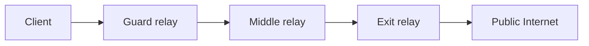

# Tor — The Onion Router

## TL;DR
Сеть из тысяч **relay-узлов** для **анонимизации** интернет-трафика. Клиент строит **circuit** через 3 случайно выбранных relay'я: **entry/guard → middle → exit**. Трафик зашифрован **слоями луковицы**: каждый relay снимает свой слой, видит только следующий hop. Никто из трёх не знает **источник + назначение** одновременно. Также **hidden services (.onion)** — сервисы только в Tor-сети.

## Какую проблему решает
**VPN** скрывает от ISP, но VPN-провайдер видит всё. **Tor** — никто из участников не знает полного пути. Сильнее анонимности, чем у VPN, ценой скорости.

Применения:
- Журналисты, активисты в авторитарных режимах.
- Whistle-blowers (SecureDrop).
- Доступ к заблокированным сайтам.
- Privacy-conscious users.
- (Также — illegal activities; Tor — нейтральный инструмент.)

## Как работает

**Onion routing:**

**Шифрование слоями:**
- Client шифрует payload **в обратном порядке**: для exit, потом для middle, потом для entry.
- Получает нечто вроде «луковицы»: outer слой → entry; внутри слой для middle; внутри слой для exit; внутри — payload для destination.
- Каждый relay расшифровывает **свой** слой → видит только next hop, не источник или назначение.

**Что видят узлы:**

| Узел | Видит src | Видит dst | Видит payload |
|---|---|---|---|
| **Entry/Guard** | да | нет | нет (encrypted) |
| **Middle** | нет | нет | нет |
| **Exit** | нет | да | да (если plain HTTP — open!) |

→ Никто не знает src + dst одновременно.

**Circuit lifetime:** ~10 минут, потом новый.

**Guard relay:** клиент использует один guard месяцами — защита от guard-rotation атак.

**Hidden services (.onion):**
- Сервис тоже скрыт через 6 hops (3 client + 3 service).
- `.onion`-адрес = hash public key сервиса.
- Только через Tor доступны.
- Известные: SecureDrop, Facebook (`facebookcorewwwi.onion`), DuckDuckGo.

## Пример
**Tor Browser:**
- Открыть browser → строится circuit.
- Запрос wikipedia.org → entry → middle → exit → wikipedia.org.
- Wikipedia видит exit relay's IP (например, в Германии), не клиента.
- Скорость: 10-100 кбит/с typical (сеть медленная).

## Связи
- **Базируется на:** криптография (RSA, AES), [[Защита персональной информации]] (общая цель).
- **Используется в:** Tor Browser, hidden services, мониторинг сети для атак.
- **Соседи по уровню:** [[VPN]] — слабее, быстрее; **I2P** — другая P2P-anonymity-сеть.
- **Противопоставляется:** open internet — нулевой anonimity.

## Подводные камни
- **Exit-relay sees plain traffic.** Если ваш HTTP не зашифрован, exit owner видит. → **HTTPS обязательно**.
- **Browser fingerprinting** — даже через Tor, браузер уникальный → деанонимизация. **Tor Browser** unifies fingerprint, но не идеально.
- **Скорость низкая** — 3 relay × latency. Для streaming/games — не подходит.
- **Exit blocking** — многие сайты (Cloudflare-banned, банки) блокируют Tor exit IPs.
- **Government surveillance:** глобальный пассивный наблюдатель (NSA-like) может **time-correlate** traffic in/out → деанонимизировать. Tor не идеален против nation-state actors.
- **Tor users tracked** — некоторые юрисдикции flag сам факт использования Tor.

## Дальше читать
- [[Защита персональной информации]] — общая privacy.
- [[VPN]] — для сравнения anonymity-models.
- Tanenbaum, гл. 8, §8.13.1 (стр. PDF 938–942).
