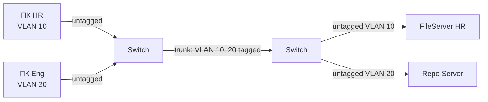

# VLAN — IEEE 802.1Q

## TL;DR
**Логическое разделение** одной физической Ethernet-сети на несколько изолированных L2-сегментов через 4-байтный **тег 802.1Q** в Ethernet-фрейме. Узлы в разных VLAN не видят друг друга на L2 (broadcast не идёт между VLAN), как будто они в разных физических сетях. Базовый инструмент сегментации в офисных и DC-сетях.

## Какую проблему решает
Раньше «изолировать отделы» = тянуть отдельный кабель и ставить отдельный switch для каждого. Дорого, негибко. С VLAN: один switch может обслуживать **N виртуальных сетей** одновременно, конфигурация изменяется программно. Также VLAN ограничивают **broadcast domains**: ARP/DHCP-broadcast'ы из одной VLAN не загромождают другие.

## Как работает

**Тег 802.1Q (4 байта между SRC MAC и EtherType):**
```
+----+--------+-------+-----+----------+
|TPID| Prio   | DEI   |VID  | EtherType|
|0x8100|3 bit |1 bit  |12 bit|2 байта  |
+----+--------+-------+-----+----------+
```
- **TPID** = `0x8100` — маркер VLAN-тега (вместо обычного EtherType).
- **PCP** (3 бита) — приоритет (для QoS, 0–7).
- **DEI** (1 бит) — Drop Eligible.
- **VID** (12 бит) — **VLAN ID**: 0–4095. VID 0 и 4095 зарезервированы → **4094 рабочих VLAN**.
- За тегом — обычный EtherType.

**Типы портов на switch'е:**
- **Access port** — принадлежит одной VLAN. Untagged-фреймы идут от хоста; switch добавляет/снимает тег при пересылке через trunk.
- **Trunk port** — между switch'ами; tagged-фреймы. Передаёт несколько VLAN.
- **Native VLAN** на trunk'е — VLAN, для которой фреймы идут без тега (для совместимости).

**Разделение трафика:**
- Switch держит таблицу `MAC → port` **per-VLAN** (или общую, в зависимости от VLAN-aware-режима).
- Broadcast в VLAN 10 идёт только в порты VLAN 10 → не виден VLAN 20.
- Пересылка между VLAN — через **L3-устройство** (router или L3-switch).



## Пример
**Офис на 200 человек:**
- VLAN 10 — HR (отдел кадров).
- VLAN 20 — Engineering.
- VLAN 30 — Guest Wi-Fi.
- VLAN 99 — Management (для админов).

Все на одних physical switch'ах, но трафик HR не виден Engineering и наоборот. Между VLAN — только через router с ACL'ом «HR может в HR-сервер, не может в Engineering-репо».

**Trunk'и между switch'ами этажей:** один кабель оптики несёт все VLAN'ы офиса tagged. Удобно для расширения.

## Связи
- **Базируется на:** [[Ethernet — IEEE 802.3]] (тег внутри фрейма), [[Коммутируемый Ethernet]] (механика switch'а).
- **Используется в:** [[Корпоративная сеть]] (главный приём сегментации), [[Spanning Tree Protocol]] (MSTP — per-VLAN дерево).
- **Соседи по уровню:** **VXLAN/Geneve** — overlay-VLAN поверх IP, до 16 млн ID, используется в DC.
- **Противопоставляется:** **физическая сегментация** — отдельный switch на VLAN. Дорого, негибко.

## Подводные камни
- **VLAN-hopping атаки:** double-tagging, switch spoofing. Защита — отключение DTP, native VLAN ≠ user VLAN, port security.
- **STP per-VLAN** — в современных сетях нагрузка на CPU switch'а от MSTP/PVST+ может быть значительной с сотнями VLAN.
- **VID 12 бит = max 4094** — мало для крупных DC, отсюда популярность VXLAN (24 бита).
- **Inter-VLAN routing** требует устройства с маршрутизацией. На коммерческих switch'ах часто доступна как «SVI» (Switched Virtual Interface) — virtualный интерфейс на VLAN.

## Дальше читать
- [[Корпоративная сеть]] — типичный сценарий.
- [[Spanning Tree Protocol]] — MSTP связка с VLAN.
- Tanenbaum, гл. 4, §4.7.5 (стр. PDF 397–404).
