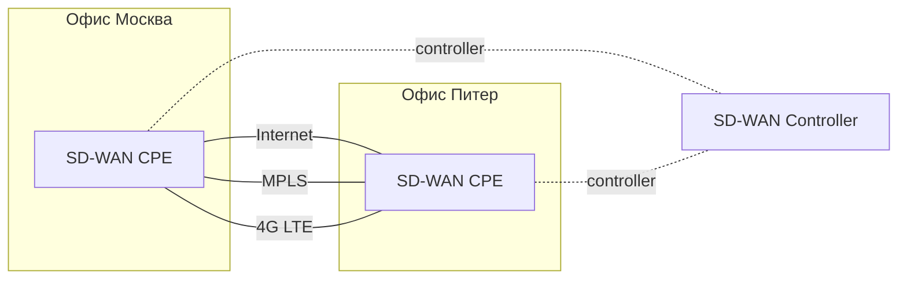

# VPN и SD-WAN

## TL;DR
**VPN site-to-site** — постоянный туннель между офисами через публичный интернет (IPsec, WireGuard). **SD-WAN** (Software-Defined WAN) — следующий шаг: централизованный контроллер управляет **множественными туннелями** (через интернет, MPLS, LTE-uplink), динамически выбирая лучший путь по latency/loss/jitter. Заменяет дорогие MPLS-leased-lines дешёвой комбинацией интернет-каналов + smart routing.

## Какую проблему решает
Корпоративный WAN исторически:
- **MPLS** от провайдера: дорого, надёжно, гарантированный SLA.
- **Internet + VPN**: дёшево, но без гарантий.

SD-WAN объединяет: несколько uplink'ов одновременно, контроллер видит реальное качество и направляет критичные приложения (VoIP, ERP) по лучшему пути. Снижает стоимость WAN на 40-80% при сохранении QoS.

## Как работает

**SD-WAN edge-устройства:**
- На каждой site-точке: **CPE** (Customer Premises Equipment) с несколькими WAN-интерфейсами (DSL, FTTH, 4G/5G, MPLS).
- Все CPE подключены к **SD-WAN контроллеру** (центральная плоскость управления).

**Транспорт:**
- **Overlay tunnels** (IPsec/proprietary) поверх каждого uplink'а.
- Один путь = один туннель. Несколько путей одновременно — multi-path.

**Routing decisions:**
- Контроллер мониторит latency, loss, jitter каждого пути.
- Применяет **policy:** «VoIP → low-latency path», «backup → cheap path», «sensitive data → MPLS».
- Изменения в реальном времени — failover за секунды, не минуты как у BGP.

**Application-aware:**
- DPI определяет тип трафика → policy decision.
- «Office 365 traffic в direct internet, не через дата-центр» — типичный optimization.

## Пример
**Сеть филиалов розничной компании (200 магазинов):**

**До SD-WAN:** каждый магазин — MPLS-канал ~$500/мес = $1.2M/год. Один канал — single point of failure.

**После SD-WAN:** каждый — два интернет-канала (FTTH + 4G backup) ~$100/мес = $240k/год. Контроллер обеспечивает SLA через intelligent routing. **5x экономия + лучшая надёжность.**

**Поставщики:** Cisco Viptela, VMware VeloCloud, Fortinet, Versa Networks, Aryaka.

## Связи
- **Базируется на:** [[VPN]] (туннели), [[Туннелирование]], [[Корпоративная сеть]] (контекст), [[SDN — программно-конфигурируемые сети]] (концептуальный родитель).
- **Используется в:** enterprise WAN, branch-office connectivity, hybrid cloud.
- **Соседи по уровню:** **SASE** (Secure Access Service Edge) — следующее поколение SD-WAN + security в облаке.
- **Противопоставляется:** **классический MPLS-WAN** — дорого, ограничены гарантии.

## Подводные камни
- **Vendor lock-in:** контроллер и edge — обычно одного вендора.
- **Internet QoS не гарантируется** — если оба интернет-канала плохие, SD-WAN не творит чудеса.
- **Multi-WAN не значит автоматически multi-path TCP** — TCP-сессия идёт по одному пути; failover при разрыве.
- **Безопасность:** SD-WAN добавляет attack-surface (контроллер, центральная управляющая плоскость).

## Дальше читать
- [[VPN]] — базовый механизм.
- [[SDN — программно-конфигурируемые сети]] — концепт.
- [[Корпоративная сеть]] — контекст.
- Tanenbaum, гл. 1, §1.3.5 (стр. PDF 48–52).
