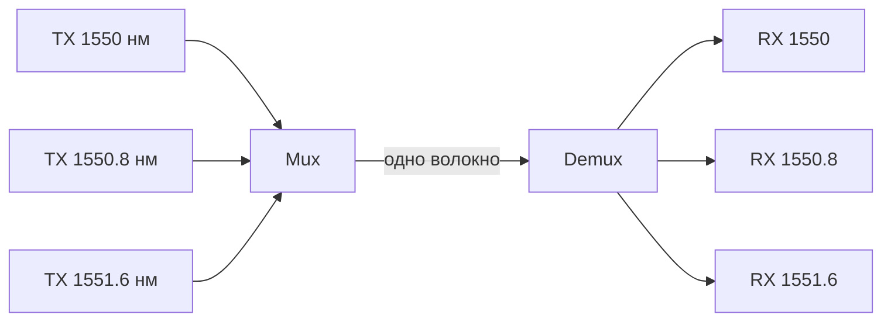

# WDM — Wavelength Division Multiplexing

## TL;DR
Множество **независимых** световых сигналов разных длин волн в **одном** оптоволокне — каждая длина волны = независимый канал. **CWDM** (Coarse): ~8-18 длин волн с шагом 20 нм, до 10 Gbps на канал. **DWDM** (Dense): 40-160 длин волн с шагом 0.4 нм, 100/400 Gbps на канал. Современная магистраль = одно волокно несёт **десятки терабит**.

## Какую проблему решает
Один прямой свет в волокне — это **уже** очень быстро. Но дополнительная электроника (кодеры, преобразователи) дороже самого волокна. Если в одном волокне передавать N независимых лучей разных частот → пропускная способность × N без укладки нового кабеля.

Это «FDM на оптике» — частоты в видимом/ИК диапазоне (~190 ТГц центром).

## Как работает

**Принцип:**
- Каждый канал использует разную длину волны (λ).
- На входе **мультиплексор** (оптический, например AWG — Arrayed Waveguide Grating) объединяет сигналы.
- В волокне они распространяются **независимо** (минимальное cross-talk при правильном выборе λ).
- На выходе **демультиплексор** разделяет.

**CWDM (ITU G.694.2):**
- 18 каналов с шагом 20 нм в 1270-1610 нм.
- Цель: 10 Gbps × 18 = ~180 Gbps в одно волокно.
- Дешевле DWDM, на короткие дистанции (metro).

**DWDM (ITU G.694.1):**
- Шаг 50/100/200 ГГц (~0.4-1.6 нм) в C-band (1530-1565 нм).
- 40-160 каналов.
- 100 Gbps на канал (current standard) → 16 Tbps в волокно.
- 400G/800G coherent — на подходе.

**EDFA (Erbium-Doped Fiber Amplifier):**
- Усиливает все каналы C-band одновременно (vs electrical regenerator per channel).
- Через 80-120 км — ставится EDFA.
- Без EDFA DWDM был бы непрактичен для длинных линий.

**ROADM** (Reconfigurable Optical Add-Drop Multiplexer):
- На промежуточных узлах magistrale можно «извлечь» некоторые wavelengths (для local clients) или «добавить» новые.
- Без полной демультиплексации — оптически.

## Пример
**Магистраль провайдера Москва-Питер:**
- Одно DWDM-fiber pair (для каждого направления).
- 80 каналов × 100 Gbps = **8 Tbps** в каждом направлении.
- EDFA каждые ~80 км.
- ROADM в крупных городах позволяет «подбирать» отдельные λ.

**Подводный кабель trans-Atlantic** (например, MAREA): несколько волокон × 200+ длин волн = десятки Pbps capacity.

## Связи
- **Базируется на:** [[Оптоволокно]] (физика), [[Мультиплексирование]] (общая идея).
- **Используется в:** все WAN-магистрали, DC-interconnect, метро-кольца, подводные кабели.
- **Соседи по уровню:** [[SONET-SDH]] / OTN — frame-формат, который часто бегает по DWDM-каналу. **Coherent optics** — современная модуляция (QAM в свете).
- **Противопоставляется:** **multi-fiber bundle** — много волокон без WDM. Кабель толще, дороже.

## Подводные камни
- **Crosstalk** между близкими каналами → жёсткие требования к лазерам.
- **Chromatic dispersion** в длинных линиях → нужны компенсаторы (DCM или electronic в coherent receivers).
- **Non-linear effects** (Kerr, FWM) в длинных линиях ограничивают канальную мощность.
- **EDFA шумят** — после 5-10 EDFA SNR деградирует, нужны 3R-regenerators.

## Дальше читать
- [[Оптоволокно]] — физика среды.
- [[Мультиплексирование]] — общая теория.
- [[SONET-SDH]] — frame-структура поверх.
- Tanenbaum, гл. 2, §2.4.4 (стр. PDF 158–166).
