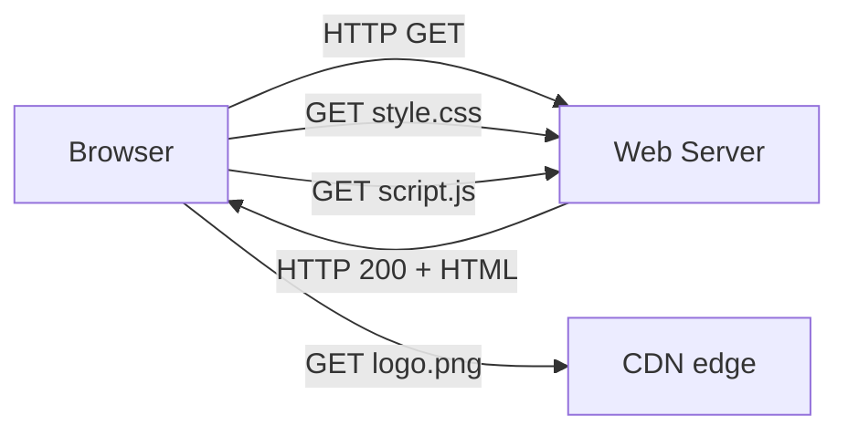

# Web — архитектура

## TL;DR
WWW (World Wide Web) — клиент-серверная архитектура: **браузер** (client) запрашивает **ресурсы** (resources, identified by URL) у **серверов** через [[HTTP]]. Ресурсы могут быть статикой (HTML/CSS/JS/PNG) или динамикой (CGI/server-side). Между ними часто **прокси/CDN** для кэширования. Изобретена Tim Berners-Lee в 1989 в CERN; сегодня — главное приложение интернета.

## Какую проблему решает
До WWW: gopher, FTP, отдельные приложения для разных целей. WWW даёт единый язык: **URL** идентифицирует **что**, **HTTP** — **как достать**. С браузером любая машина — клиент любого сервера. Принцип «hypertext» — связи между документами через URL.

## Как работает

**URL:**
```
https://example.com:443/path/page?q=val#section
└─┬─┘ └────┬────┘ └┬┘ └─┬──┘ └─┬─┘ └──┬─┘
schemе    хост   port  path  query fragment
```

**Шаги загрузки страницы:**
1. Юзер вводит URL → браузер.
2. **DNS-lookup** домена → IP.
3. **TCP/QUIC connect** → handshake.
4. **TLS handshake** (для HTTPS).
5. **HTTP-запрос** GET /.
6. **HTTP-ответ** — HTML.
7. Браузер парсит HTML → видит ссылки на CSS, JS, images → новые HTTP-запросы (часто параллельно через keep-alive или HTTP/2 multiplexing).
8. Рендеринг страницы.



**Слои web-стэка:**
- **Static:** HTML/CSS/JS/img — отдают серверы или CDN.
- **Dynamic:** server-side рендеринг (PHP, Python, Java) или client-side через AJAX/SPA.
- **APIs:** REST/GraphQL/gRPC для frontend ↔ backend communication.
- **CDN:** edge-кэширование статики и иногда динамики.

## Пример
**Открытие `wikipedia.org`:**
- DNS → 208.80.154.224 (Wikimedia + CDN).
- HTTPS connect.
- GET / → HTML (~50 КБ).
- HTML ссылается на ~30 ресурсов (CSS, JS, images).
- Браузер делает 30 requests, мультиплексирует через HTTP/2.
- Картинки часто с CDN-домена (`upload.wikimedia.org`) — отдельные TLS-сессии.
- Через 1-2 секунды страница visible.

## Связи
- **Базируется на:** [[Клиент-сервер vs P2P]] (модель), [[DNS]] (резолв), [[TCP]]/[[QUIC]] (transport).
- **Используется в:** [[HTTP]], [[HTTPS]], [[HTTP/2 и HTTP/3]], [[Веб-кэширование и прокси]], [[CDN — устройство]] — конкретные технологии.
- **Соседи по уровню:** [[Cookies и web tracking]], [[Динамические веб-приложения]].
- **Противопоставляется:** P2P-сети — другая модель доставки контента.

## Подводные камни
- **Same-origin policy** — критическая security-граница. CORS ослабляет для контролируемых случаев.
- **Mixed content** — HTTPS-страница загружает HTTP-ресурс — браузеры блокируют.
- **Web ≠ интернет.** Web — лишь одно приложение интернета (хотя самое заметное).

## Дальше читать
- [[HTTP]], [[HTTPS]], [[HTTP/2 и HTTP/3]] — главный transport-протокол.
- [[Cookies и web tracking]], [[Веб-кэширование и прокси]] — практики.
- Tanenbaum, гл. 7, §7.3.1 (стр. PDF 726–735).
