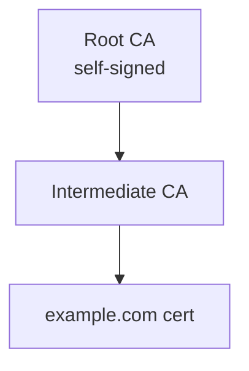

# X.509 сертификаты (ITU-T X.509, RFC 5280)

## TL;DR
**Стандарт связывания публичного ключа с identity** через подпись доверенной третьей стороны (**CA — Certificate Authority**). Содержит: **Subject** (для кого), **Issuer** (кто подписал), **Public Key**, **Validity Period**, **Extensions** (SAN, key usage). Подпись CA — основа доверия. Используется в HTTPS, S/MIME, code signing, smartcards.

## Какую проблему решает
Когда вы подключаетесь к `wikipedia.org`, как убедиться, что **public key** действительно принадлежит Wikipedia, а не злоумышленнику в роли MITM? Сертификат: «**доверенная** CA подтверждает, что этот public_key принадлежит wikipedia.org». Если вы доверяете CA — доверяете и сертификату.

## Как работает

**Структура (упрощённо):**
```
Certificate
├── tbsCertificate (to be signed)
│   ├── version (v3)
│   ├── serialNumber
│   ├── signatureAlgorithm
│   ├── issuer (DN of CA)
│   ├── validity (notBefore, notAfter)
│   ├── subject (DN: CN=example.com, ...)
│   ├── subjectPublicKeyInfo (algorithm + public key)
│   └── extensions (SAN, KeyUsage, BasicConstraints, ...)
├── signatureAlgorithm
└── signatureValue (CA signs hash of tbsCertificate)
```

**Главные extensions:**
- **Subject Alternative Name (SAN):** список доменов, для которых валиден (`*.example.com`, `example.com`).
- **Key Usage:** что разрешено (digital signature, key agreement, certificate sign).
- **Basic Constraints:** CA=TRUE/FALSE, pathlen.
- **CRL Distribution Points / OCSP:** где проверять revocation.
- **Extended Key Usage:** TLS server, TLS client, code signing, S/MIME.

**Цепочка доверия (chain of trust):**
- **Leaf certificate** для `example.com` подписан intermediate CA.
- **Intermediate** подписан **root**.
- **Root** — self-signed, в **trust store** ОС/браузера.
- Браузер проверяет всю цепочку.



**Формат:** PEM (base64-encoded DER, `-----BEGIN CERTIFICATE-----`) или binary DER.

## Пример
**Просмотр сертификата сайта:**
```bash
$ openssl s_client -connect wikipedia.org:443 -showcerts
```
- Subject: `CN=*.wikipedia.org`.
- Issuer: `Let's Encrypt R3`.
- Validity: 90 days.
- SAN: список всех доменов Wikipedia.
- Подписан Let's Encrypt R3 (intermediate).
- Let's Encrypt R3 подписан ISRG Root X1 (in browser trust store).

## Связи
- **Базируется на:** [[Цифровая подпись]] (механизм), асимметричная криптография.
- **Используется в:** [[TLS — рукопожатие]] (HTTPS), [[PKI и центры сертификации]] (инфраструктура), S/MIME, code signing.
- **Соседи по уровню:** **PGP** — альтернативная модель доверия (web of trust); **DANE** — DNS-based authentication через DNSSEC.
- **Противопоставляется:** self-signed certificate — не доверенно по умолчанию.

## Подводные камни
- **Sertificate pinning** — не доверять любому CA, а только конкретному. Mobile apps часто делают.
- **Certificate Transparency (CT):** все public-issued certs публикуются в публичных логах → детектирование misissue.
- **Wildcard certs** (`*.example.com`) удобны, но риск: один stolen private — все subdomains compromised.
- **Revocation** проблематична: CRL медленный, OCSP — privacy concerns. **Short-lived certs** (Let's Encrypt 90 days) — современный подход.

## См. также (прикладное)
RF-circumvention: X.509 — основа Self-Steal и LE-cert обхода.
- [[Self-Steal — свой домен]] — реальный сертификат от Let's Encrypt на собственном домене + nginx + path-based VPN-proxy.
- [[VLESS-Reality]] — использует **чужой** валидный сертификат target-сайта (microsoft.com и т.п.) без подмены.
- [[PB5 — РФ-каскад с xHTTP+packet-up]], [[PB6 — Nginx+LE с разделением IP]], [[PB11 — Self-Steal-only без РФ-моста]] — playbooks с LE-сертификатами.
- [[applied-rf-status]] — обзор.

## Дальше читать
- [[PKI и центры сертификации]] — инфраструктура.
- [[TLS — рукопожатие]] — главный потребитель.
- Tanenbaum, гл. 8, §8.8.2 (стр. PDF 890–892).
