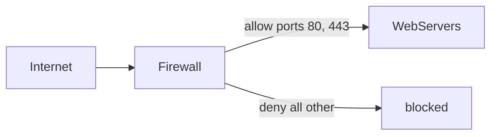

# Брандмауэр (firewall)

## TL;DR
Узел на границе сети, **фильтрующий трафик** по правилам. Три уровня сложности: **stateless packet filter** (ACL по 5-tuple), **stateful** (хранит соединения, разрешает only «начинающие» с одной стороны), **application-layer** (NGFW — глубокая инспекция, понимание HTTP/SQL и т.п.). Ключевой компонент периметра, но **не панацея** — внутренние угрозы и encrypted-трафик ему не видны.

## Какую проблему решает
Internet полон сканеров, ботнетов, малваров. Без фильтра любая открытая служба под обстрелом. Firewall — **минимальный** периметр: что наружу можно, что нельзя.

## Как работает

### Stateless packet filter
- Простые ACL: `(srcIP, srcPort, dstIP, dstPort, proto) → allow/deny`.
- Не хранит state — каждый пакет рассматривается отдельно.
- **Минус:** не различает inbound/outbound в context соединения. Reply на ваш TCP-handshake может быть заблокирован.

### Stateful firewall
- Хранит **state-table** активных соединений.
- Связывает входящие пакеты с **established sessions** → пропускает return-traffic; новые connections — только согласно правилам.
- **Главный** тип в современных сетях.

### Application-layer (NGFW — Next-Generation Firewall)
- Понимает **L7** (HTTP, SQL, DNS).
- Может: «не пускать загрузки .exe», «блокировать SQL injection signatures», «inspect TLS» (если deploy'ен с corporate CA).
- Тяжёлый, но мощный.

### Personal firewall
- На хосте (Windows Defender Firewall, ufw, pf).
- Защищает endpoint.

**Типичные правила (deny by default):**
- Allow: tcp/443, tcp/80 → web-сервер.
- Allow: tcp/22 → admin-сеть only.
- Allow: udp/53 → DNS-сервер.
- Allow: established/related (auto в stateful).
- Deny: all other.

## Пример
**Корпоративный стандарт:**
- **Internet → DMZ:** allow 80/443 to публичные веб-серверы.
- **DMZ → Internal:** deny except specific RPC к back-end DB.
- **Internal → Internet:** allow most outbound (filter через прокси на уровне приложений).
- **Inter-VLAN:** stateful между сегментами (HR не видит engineering).

**Cloud security groups:** AWS/GCP — это distributed stateful firewall: правила на каждом VM-инстансе.

## Связи
- **Базируется на:** [[Сетевой уровень]], [[TCP]] (5-tuple).
- **Используется в:** периметровая защита, segmentation между сегментами.
- **Соседи по уровню:** [[IDS и IPS]] — детектирование/предотвращение поверх firewall'а; **WAF** — application-firewall для веба.
- **Противопоставляется:** «open network» — ничего не фильтруется. Зеро-trust сети — firewall всё ещё есть, но по-другому.

## Подводные камни
- **Encrypted traffic** firewall не видит payload. NGFW требует TLS-MITM для DPI — компромисс.
- **Insider threat** — внутри сети firewall не помогает. Поэтому **micro-segmentation** + zero-trust.
- **VPN-туннели** обходят periметровый firewall — корпоративные политики должны учитывать.
- **Cloud-native:** в облаке firewall — это software config, не «коробочка». Полностью elastic, ставится на кажный workload.

## См. также (прикладное)
RF-circumvention: государственный «брандмауэр» РФ реализован как DPI-stack на узлах операторов.
- [[ТСПУ]] — РДП.РУ-инфраструктура, ФЗ-90 «суверенный интернет».
- [[DPI-фильтрация в РФ]] — сводный обзор методов (SNI, AS, session-freezing, active-probing).
- [[Белые списки]] — режим «default-deny» на mobile-операторах с 2025-2026.
- [[Active probing]] — DPI само подключается к suspicious IP.
- [[applied-rf-status]] — что работает на обход.

## Дальше читать
- [[IDS и IPS]] — детектирование.
- [[VPN]] — что обходит fфайрвол.
- Tanenbaum, гл. 8, §8.3.1 (стр. PDF 844–847).
