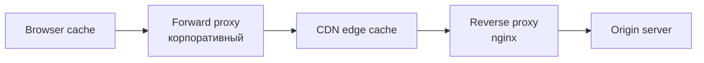

# Веб-кэширование и прокси

## TL;DR
**HTTP-кэш** хранит копии ответов и отдаёт их без обращения к origin. Работает на 4 уровнях: **браузер**, **forward proxy** (на сети клиента), **reverse proxy / CDN** (перед сервером), **gateway cache**. Управляется через `Cache-Control`, `ETag`, `Last-Modified`. Снижает нагрузку, ускоряет, экономит трафик.

## Какую проблему решает
Большая часть веб-контента **не меняется на каждый запрос**: картинки, CSS, JS, статья. Слать те же байты миллионам клиентов с одного сервера — расточительно. Кэш — решение: сохранили один раз, отдаём всем местно.

## Как работает

**Cache-Control header (RFC 9111):**
- `max-age=3600` — свежий 1 час.
- `s-maxage=86400` — для shared cache (CDN), своё значение.
- `public` — можно кэшировать в shared.
- `private` — только в браузере.
- `no-cache` — кэшируется, но **revalidate** перед использованием.
- `no-store` — не кэшировать вообще.
- `immutable` — гарантия неизменности → даже не revalidate.

**Validators:**
- **ETag:** `"abc123"` — opaque-токен версии. Клиент: `If-None-Match: "abc123"` → сервер либо `304 Not Modified` (кэш ещё валиден), либо `200` с новым контентом.
- **Last-Modified:** дата. Клиент: `If-Modified-Since: ...`.

**Freshness flow:**
1. Запрос → проверка кэша.
2. Если свежий (within max-age) → отдать из кэша. Зачёркнуто.
3. Если устаревший → revalidate с сервером.
4. Сервер: 200 (новое) или 304 (без body, использовать кэш).

**Прокси-типы:**
- **Forward proxy:** перед клиентами в LAN/корп. сети. Кэширует исходящий трафик; фильтрует.
- **Reverse proxy:** перед серверами. Кэширует, balanc'ит, terminates TLS.
- **Transparent proxy:** клиент не знает о proxy (intercepts at network).
- **CDN:** глобально-распределённая reverse-proxy сеть.

## Пример
**Картинка на новостном сайте:**
- `Cache-Control: public, max-age=31536000, immutable`
- Имя файла включает hash — изменение → новое имя.
- Браузер хранит локально 1 год.
- CDN edges хранят, отдают близко к клиенту.
- Nagрузка на origin — нулевая.

**API response с приватными данными:**
- `Cache-Control: private, no-store` — не кэшировать вообще; ETag тоже не нужен.

## Связи
- **Базируется на:** [[HTTP]] (механизм headers).
- **Используется в:** [[CDN — сеть доставки контента]], [[CDN — устройство]] — масштабное кэширование.
- **Соседи по уровню:** **service worker** в браузере — programmatic caching; **localStorage** — другая модель.
- **Противопоставляется:** «всегда из origin» — не масштабируется на популярные ресурсы.

## Подводные камни
- **Cache invalidation** — «one of two hard problems in CS». Стратегии: **versioned URLs** (`script.abc123.js`), **cache-busting query** (`?v=2`), explicit purge API на CDN.
- **Vary header** — `Vary: Accept-Encoding, User-Agent` сохраняет разные копии для разных клиентов.
- **Cookies + кэш** — cookies делают response персональным → обычно не кэшируется. Поэтому **static assets без cookies**.

## Дальше читать
- [[HTTP]] — headers.
- [[CDN — сеть доставки контента]], [[CDN — устройство]] — масштабное.
- Tanenbaum, гл. 7, §7.5.2 (стр. PDF 788–792).
