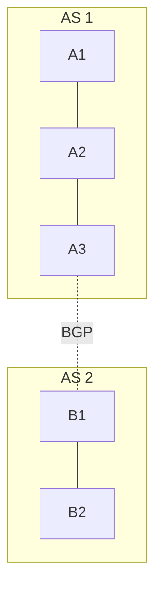

# Иерархическая маршрутизация

## TL;DR
В сети с миллионами маршрутизаторов один общий алгоритм маршрутизации не работает: таблицы слишком большие, конвергенция слишком медленная. Решение — **иерархия**: разбить сеть на **регионы (areas, AS)**, внутри региона — детальная маршрутизация, между регионами — агрегированная. Каждый маршрутизатор хранит детали только своего региона + summary остальных. Архитектура интернета (AS + BGP) — главный пример.

## Какую проблему решает
Линейный рост: 50 узлов = 50 записей в таблице, OK. 50 000 узлов = 50 000 записей, медленно. 5 миллионов = катастрофа. Иерархия даёт **логарифмический** рост: маршрутизатор знает свою сотню узлов детально + ~20 регионов в остальных регионах. Таблица растёт как O(N + R), где R — число регионов, не O(N).

## Как работает

**Двухуровневая иерархия:**
- **Регионы (areas):** группы маршрутизаторов, обменивающиеся внутри-региональным IGP (OSPF, IS-IS, RIP).
- **Между регионами:** агрегированные адреса, EGP-протокол (BGP).
- На границе — **border routers** (ABR в OSPF, ASBR между AS).

**Иерархия адресов:** требует **агрегированной** адресации. CIDR (см. [[IP-адресация и CIDR]]) позволяет говорить «весь блок 10.0.0.0/8 — через AS X», не перечисляя миллионы /32-адресов внутри.

**Агрегация:** маршрутизатор в AS 1 знает: «всё в AS 2 — через A3». Внутри AS 2 — детали скрыты.

## Пример
**Интернет:**
- ~75 000 AS глобально.
- Внутри каждой AS — OSPF/IS-IS, обычно с дополнительной иерархией (areas).
- Между AS — BGP.
- Маршрутизатор провайдера держит ~1 млн BGP-routes (адресных префиксов), не все 5 млрд хостов мира — благодаря CIDR-агрегации.

**OSPF areas:**
- Area 0 (backbone) — обязательная.
- Areas 1, 2, … — спицы, подключаются к area 0 через ABR.
- Каждый маршрутизатор знает свою area детально + summary других через ABR.

## Связи
- **Базируется на:** [[Distance Vector Routing]], [[Link State Routing]] (инструменты внутри регионов), [[IP-адресация и CIDR]] (агрегация).
- **Используется в:** [[OSPF]] (areas), [[BGP]] (AS), архитектура интернета.
- **Соседи по уровню:** **route summarization** — техника агрегации соседних префиксов.
- **Противопоставляется:** flat routing — не масштабируется на интернет.

## Подводные камни
- **Subоптимальные пути:** иерархия скрывает детали → пакет может пойти неоптимально (через ABR, хотя есть короткий внутри-area путь). Классический trade-off масштабируемости vs оптимальности.
- **Граница areas/AS** — критическая точка отказа: ABR/border router падает → регионы теряют связь.
- В дата-центрах часто вернулись к **flat** L3 fabric (тысячи ToR с BGP) — современное железо тянет таблицы и без иерархии.

## Дальше читать
- [[OSPF]] (areas) и [[BGP]] (AS) — два уровня иерархии в реальном интернете.
- [[IP-адресация и CIDR]] — основа агрегации.
- Tanenbaum, гл. 5, §5.2.6 (стр. PDF 437–438).
