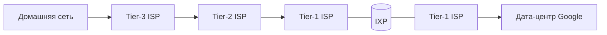

# Интернет — архитектура

## TL;DR
Интернет — это **сеть из сетей**: десятки тысяч независимых сетей разных компаний и стран соединены вместе. Каждая такая независимая сеть называется **автономной системой (AS — autonomous system)**; внутри неё оператор сам решает, как всё устроено. А договариваются AS друг с другом через единый протокол [[BGP]]. Общий язык всех — **IP-адреса** (см. [[IPv4]], [[IP-адресация и CIDR]]) плюс единая система имён [[DNS]].

## Какую проблему решает
Соединить сети, принадлежащие разным организациям, странам и юрисдикциям, **без** центрального управления, чтобы любой узел мог общаться с любым другим. Решение: общий протокол сетевого уровня (IP), децентрализованная маршрутизация (BGP) и иерархическая система имён (DNS).

## Как работает

**Узлы:**
- **Конечные пользователи** в сетях провайдеров.
- **Провайдеры (ISP):** Tier 1 (магистральные), Tier 2 (региональные), Tier 3 (последняя миля).
- **Контент-сети:** Google, Akamai, Cloudflare — фактически крупные ISP по объёму трафика.
- **IXP (Internet eXchange Point):** физические точки обмена трафиком — DE-CIX (Франкфурт), MSK-IX (Москва).

**Связи между AS:**
- **Транзит:** AS-A платит AS-B за «пропустить мой трафик куда угодно» — см. [[Транзитная сеть]].
- **Пиринг:** две AS бесплатно обмениваются трафиком своих клиентов (settlement-free peering).

**Аналогия с дорогами:** Tier-1 ≈ магистральные автотрассы между странами; Tier-3 ≈ городские улицы до твоего дома; IXP ≈ перекрёсток-развязка, где трассы встречаются и можно пересесть. Транзит ≈ платный проезд по чужой трассе; пиринг ≈ бесплатный проезд между соседними развязками для своих машин.

**Уровни:**
- L3: IP (общий для всех).
- L4: TCP/UDP/QUIC.
- L7: HTTP/DNS/SMTP и др.

## Пример
Открываешь `youtube.com`:
1. [[DNS]] возвращает IP сервера Google (часто — близко к тебе через [[CDN — сеть доставки контента]] и умную маршрутизацию на ближайший дата-центр — anycast).
2. TCP/QUIC handshake.
3. Пакеты идут: твой ноут → домашний роутер → Tier-3 ISP → возможно Tier-2 → IXP → сеть Google → дата-центр.
4. На любом из этих хопов оператор может видеть IP-адреса; payload защищён TLS.

Сколько AS прошли — обычно 3–5; бывает больше при географическом удалении.

## Связи
- **Базируется на:** [[Маршрутизатор]] (узлы, формирующие интернет), [[Эталонная модель TCP/IP]] (стек протоколов).
- **Используется в:** [[BGP]] (протокол между AS), [[IP-адресация и CIDR]] (адреса AS), [[CDN — устройство]] (надстройка для доставки контента).
- **Соседи по уровню:** [[Транзитная сеть]] — экономическая модель связности.
- **Противопоставляется:** «один большой роутер» — у интернета **нет** центра. Никто не может его выключить целиком.

## Подводные камни
- «Интернет» в обиходе = «WWW», но это не одно и то же. WWW — одно из приложений интернета.
- Tier 1 — не точное определение, а индустриальная классификация: AS, не покупающая транзит ни у кого. Их около 10–15 в мире.
- Интернет **очень** иерархичен сегодня: ~5 контент-провайдеров несут более половины трафика.
- BGP-маршруты могут меняться по политическим/коммерческим причинам, не только техническим.

## Дальше читать
- [[BGP]] — клей между AS.
- [[IP-адресация и CIDR]] — как раздаются адреса.
- [[Транзитная сеть]] — экономика связности.
- [[CDN — устройство]] — что поверх этой архитектуры.
- Tanenbaum, гл. 1, §1.4.1; гл. 5 (стр. PDF 53–65, 412–562).
