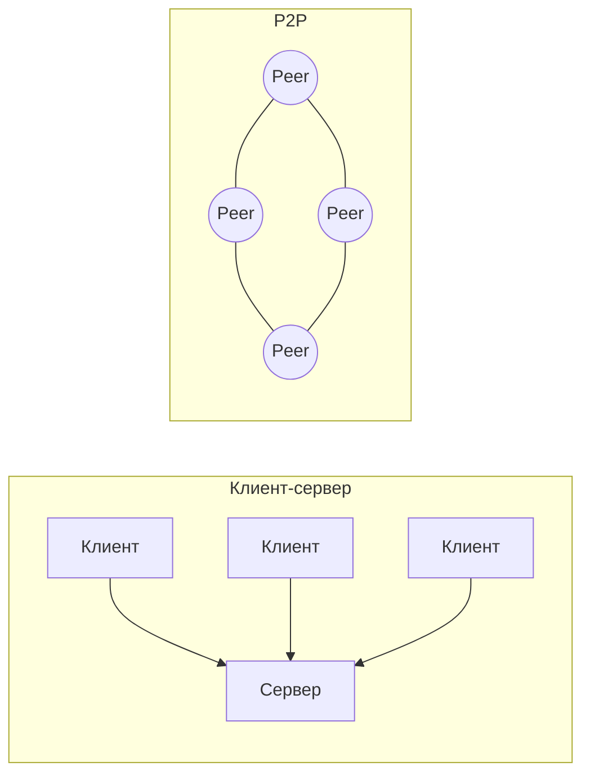

# Клиент-сервер vs P2P

## TL;DR
Две модели взаимодействия в сети. **Клиент-сервер**: одна сторона (сервер) ждёт запросов и обслуживает, другая (клиент) инициирует. **P2P (peer-to-peer)**: все узлы равноправны, каждый одновременно и клиент и сервер для других. Большая часть приложений интернета — клиент-сервер; P2P доминирует в файлообмене, блокчейне и некоторых VoIP.

## Какую проблему решает
Когда нужно дать сервис многим — кто-то должен быть «постоянно доступен» и иметь ресурсы. В клиент-серверной модели ответственность централизована: за uptime, безопасность, обновления отвечает оператор сервера. В P2P нагрузка распределена: чем больше пользователей, тем больше суммарных ресурсов системы — но тем сложнее координация и сложнее возложить ответственность.

## Как работает

**Клиент-сервер:**
- Сервер запущен 24/7, имеет публичный адрес, ждёт соединений на известном порту.
- Клиент знает адрес/имя сервера, инициирует соединение.
- Один сервер — много клиентов; масштабирование через **серверные фермы** + балансировку.

**P2P:**
- Каждый узел и просит, и отдаёт.
- Координация: либо через **центрального трекера** (старый BitTorrent), либо через **DHT** (Distributed Hash Table — Kademlia, Chord), либо через **gossip**.
- Контент часто разбит на блоки, каждый узел хранит часть и обменивается с соседями.

## Пример
- **Клиент-сервер:** YouTube, Wikipedia, gmail. Запрос идёт к серверам компании, ответ оттуда. Без серверов — нет сервиса.
- **P2P:** BitTorrent — скачиваешь Linux ISO; одновременно отдаёшь куски тем, кто качает. Никто «не владеет» файлом централизованно.
- **Гибрид:** Skype исторически был P2P для медиа, клиент-сервер для логина. Биткоин — P2P для блоков, но клиенты-кошельки часто общаются через посредников.
- **Email** — особый случай: между серверами SMTP, конечный пользователь — клиент IMAP. Тоже гибрид.

## Связи
- **Базируется на:** [[Компьютерная сеть]] — это две модели её использования.
- **Используется в:** [[Web — архитектура]] (клиент-сервер), [[P2P-сети]] (детальный разбор в гл. 7).
- **Соседи по уровню:** [[CDN — сеть доставки контента]] — клиент-серверная модель, размазанная по edge.
- **Противопоставляется:** именно эта пара противопоставляется в заметке.

## Подводные камни
- «Клиент-сервер не масштабируется, P2P масштабируется» — миф. Современные клиент-серверные системы (Google, Netflix) с CDN и шардированием обслуживают миллиарды. P2P-системы (BitTorrent) требуют **активного** участия пиров — без пиров сеть пуста.
- В клиент-серверной модели сервер может быть **несколькими машинами** (replica set, кластер). Снаружи — один логический сервер.
- В P2P часто скрыт центральный сервис (трекер, indexer, регистратор). «Полностью децентрализованных» систем мало.

## Дальше читать
- [[P2P-сети]] — BitTorrent, DHT, Kademlia (гл. 7).
- [[CDN — сеть доставки контента]] — клиент-сервер с географическим распределением.
- Tanenbaum, гл. 1, §1.1.1 (стр. PDF 27–30).
