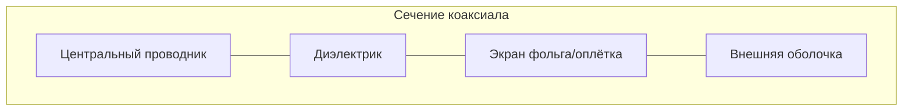

# Коаксиальный кабель (coaxial cable)

## TL;DR
Внутренний медный проводник, окружённый изолятором, поверх которого — внешний экран в виде сетки/фольги, а сверху — внешняя изоляция. **Концентрическая** конструкция (от лат. *coaxis* — «общая ось») даёт хорошую защиту от помех и низкое затухание. Историческая среда Ethernet 10BASE2/5; сейчас — основа кабельных сетей и промежуточных линий.

## Какую проблему решает
Витая пара хорошо борется с помехами через скрутку, но имеет ограниченную полосу пропускания (сотни МГц). Для передачи **ТВ-сигналов и широкополосных данных** на сотни метров нужен сигнал в гигагерцевой полосе с сильным экранированием. Коаксиальный кабель за счёт концентрической геометрии сочетает высокую полосу пропускания и низкие потери.

## Как работает
- Внутренний проводник несёт сигнал.
- Внешний экран заземлён и **окружает** сигнал со всех сторон → ЭМ-волна остаётся внутри (TEM-мода).
- Помехи **снаружи** экрана не попадают на центральный проводник.
- Помехи **изнутри** не выходят наружу (низкое излучение).

**Виды:**
- **50 Ом** — для передачи данных (Ethernet 10BASE-2 «thin», 10BASE-5 «thick»; современные — RG-58, RG-8).
- **75 Ом** — для ТВ и кабельных сетей (RG-6, RG-11). Используется в [[HFC — гибридная сеть|HFC]] и [[DOCSIS]].

## Пример
- **Кабельный интернет:** провайдер тянет 75-омный коаксиал от узла HFC в дом, в дом ставится модем DOCSIS, через который и идут данные и ТВ.
- **Антенный кабель ТВ:** старый ТВ — RG-6 от антенны/спутника к ресиверу.
- **Ethernet 1980-х:** 10BASE-5 «thick yellow» с проколом-вампиром, 10BASE-2 «thin» с BNC-разъёмом — устарели.

## Связи
- **Базируется на:** [[Среда передачи данных]] — частный случай проводной среды.
- **Используется в:** [[HFC — гибридная сеть]], [[DOCSIS]] — массовое применение сегодня.
- **Соседи по уровню:** [[Витая пара]] — соперник в LAN-эпоху, проиграл по цене и удобству; [[Оптоволокно]] — победил коаксиал на магистралях.
- **Противопоставляется:** витая пара — дешевле, удобнее, но меньше полосы. Оптика — выше всё, но дороже.

## Подводные камни
- В современных LAN коаксиал почти не встречается — заменён витой парой и оптикой.
- 50 Ом и 75 Ом **не взаимозаменяемы** — рассогласование импеданса даёт отражения и потери.
- BNC и F-разъёмы — два разных мира (LAN и ТВ соответственно).

## Дальше читать
- [[HFC — гибридная сеть]] — современная гибридная архитектура с коаксиалом «на последней миле».
- [[DOCSIS]] — протокол интернета поверх кабельного ТВ.
- Tanenbaum, гл. 2, §2.1.3 (стр. PDF 125–126).
