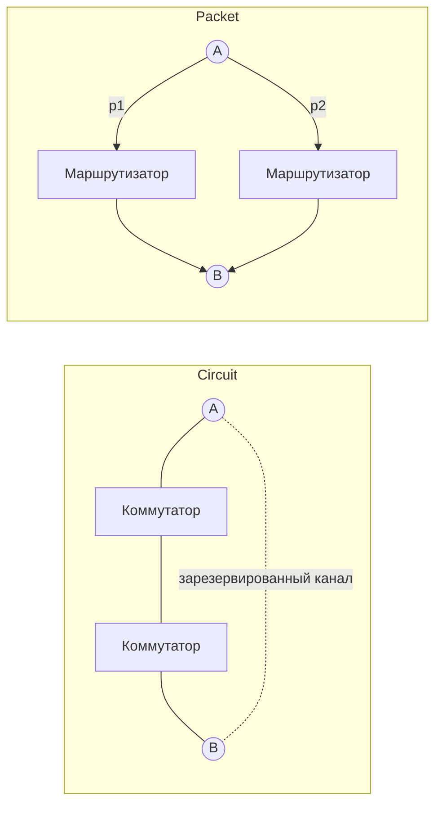

# Коммутация пакетов vs коммутация каналов

## TL;DR
Два способа доставки данных. **Коммутация каналов** (circuit switching) — заранее резервирует канал по всему пути, и весь разговор идёт по нему: телефонная сеть. **Коммутация пакетов** (packet switching) — данные режут на пакеты, каждый идёт независимо по обычно разным маршрутам, ресурсы делятся динамически: интернет.

## Какую проблему решает
Решает фундаментальный архитектурный выбор: **резервировать ресурсы заранее** (предсказуемое качество, но простаивающая ёмкость, когда никто не говорит) или **делить динамически** (высокая утилизация, но возможна перегрузка). Этот выбор определяет, как сеть ведёт себя при сбоях, как масштабируется и какие приложения хорошо на ней живут.

## Как работает

| | Коммутация каналов | Коммутация пакетов |
|---|---|---|
| Установление | резервируется путь от A до B | не нужно |
| Адресация | задаётся при установке | в каждом пакете |
| Маршрут | один на всю сессию | разные пакеты — разные маршруты |
| Эффект сбоя узла | разрыв всех каналов через него | пакеты переадресуются |
| QoS | гарантированный | best-effort, требует доп. механизмов |
| Эффективность | низкая при тишине | высокая |
| Тарификация | по времени | по объёму данных |

## Пример
- **Каналы:** телефонный звонок из 1990-х. Поднял трубку → АТС нашла свободный путь до собеседника → канал занят, пока не положили трубку. Если ничего не говоришь — канал всё равно занят.
- **Пакеты:** скачивание файла по интернету. Пакеты идут разными путями, могут прийти не по порядку, теряются и пересылаются. Когда не качаешь — ресурсы достаются другим.
- **Гибрид:** в 4G/LTE голос идёт поверх IP (VoLTE), но с приоритетом и резервированием — фактически коммутация пакетов с эмуляцией каналов.

## Связи
- **Базируется на:** [[Компьютерная сеть]] — это альтернативные способы её устроить.
- **Используется в:** [[Datagram subnet vs virtual-circuit subnet]] (та же дихотомия на сетевом уровне), [[Сотовая сеть — обзор]] (эволюция от каналов к пакетам в 4G).
- **Соседи по уровню:** [[Соединение vs без соединения]] — другая, перпендикулярная ось.
- **Противопоставляется:** именно эта статья — про противопоставление. Резервирование vs разделение.

## Подводные камни
- «Каналы = надёжно, пакеты = ненадёжно» — упрощение. Каналы дают предсказуемое качество в точке потребления, но при обрыве пути теряют **всё**. Пакеты теряют отдельные пакеты, но переживают отказы инфраструктуры.
- В современных сетях провайдеров часто используются **виртуальные каналы** (MPLS, ATM) — пакетная физика, но с резервированием путей.
- Коммутация пакетов — основа интернета не потому, что лучше во всём, а потому, что устойчива к сбоям (исходное военное требование ARPANET).

## Дальше читать
- [[Datagram subnet vs virtual-circuit subnet]] — детальное обсуждение в гл. 5.
- [[Перегрузка сети]] — главная проблема, которую решает коммутация пакетов.
- Tanenbaum, гл. 1, §1.4.2; гл. 5, §5.1 (стр. PDF 67–68, 412–419).
