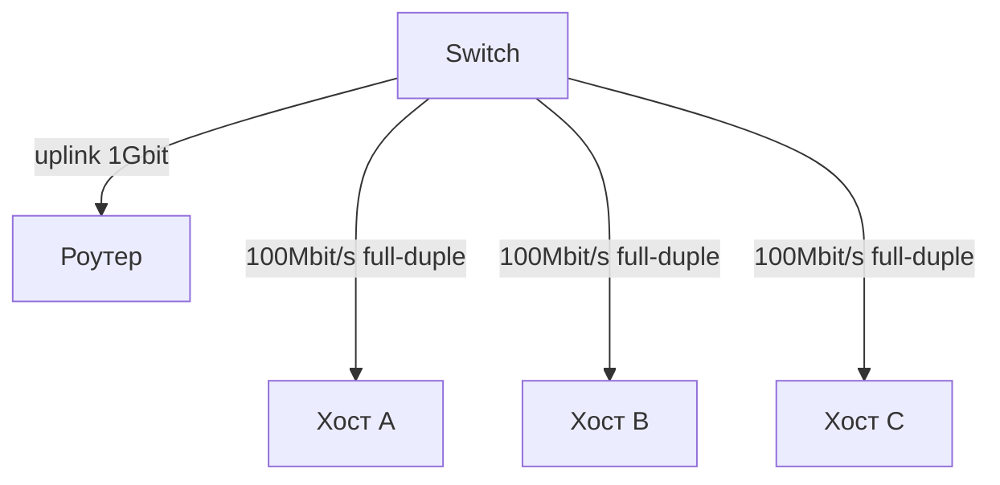

# Коммутируемый Ethernet (Switched Ethernet)

## TL;DR
Современная топология Ethernet: вместо общей шины или хаба — **switch**, у которого каждый порт это **отдельная двухточечная линия**. Switch использует таблицу `MAC → порт`, чтобы пересылать фреймы только адресату. Каждый порт — свой коллизионный домен (по сути их **нет** при full-duplex). Дал кратное повышение производительности и сделал [[CSMA/CD]] неактуальным.

## Какую проблему решает
В классическом 10BASE-T с хабом все хосты делят одну логическую среду: одновременно может говорить только один. При 10 хостах эффективная скорость на каждого ≈ 1/10 от 10 Мбит/с, плюс коллизии. Switch это исправляет: **полная скорость канала на каждый порт**, никаких коллизий, выделенный двухточечный линк к каждому устройству.

## Как работает

**Switch и его таблица:**
- При получении фрейма читает **DST MAC**.
- Ищет в таблице `MAC → порт`.
- Найдено → пересылает только в нужный порт.
- Не найдено → flood (передаёт во все порты, кроме входящего) — пока не научится.
- Параллельно учится: **запоминает SRC MAC** и порт-источник для будущей адресации.

(См. [[Мост и обучающийся мост]] — это и есть switch.)

**Full-duplex:** на двухточечном линке между NIC и switch одновременно передача и приём — ёмкость удваивается. CSMA/CD **выключен** (нет коллизий по определению). Поддерживается с 100BASE-TX.

**Cut-through vs store-and-forward:**
- **Store-and-forward:** switch принимает весь фрейм, проверяет CRC, пересылает. Безопаснее (фильтрует ошибочные), задержка ~фрейм/скорость.
- **Cut-through:** начинает пересылку как только прочитал DST (~14 байт). Ниже задержка, но передаёт ошибки.

Современные дата-центры часто cut-through (ASIC-switches с латентностью < 1 мкс). Офисы — store-and-forward.

## Пример
**Офис на 100 рабочих мест, gigabit Ethernet:**
- Каждый ПК подключён 1 Гбит/с к access-switch.
- Access-switch'и подключены 10 Гбит/с к ядру.
- 100 ПК скачивают что-то с file-server одновременно: каждый получает свою долю — на server'e bottleneck, не в LAN-фабрике.

**Сравнение со старым хабом:**
- 10BASE-T с хабом, 10 устройств: ~1 Мбит/с на каждое.
- 1000BASE-T с switch'ом, 10 устройств: 1 Гбит/с на каждое (если не упираются в общий uplink).

## Связи
- **Базируется на:** [[Ethernet — IEEE 802.3]], [[Мост и обучающийся мост]] (механика switch'а).
- **Используется в:** все современные офисные/домашние LAN; [[VLAN — IEEE 802.1Q]] (логическая сегментация); [[Spanning Tree Protocol]] (защита от петель в топологии switch'ей).
- **Соседи по уровню:** [[Hub vs Switch vs Router vs Gateway]] — где switch на иерархии.
- **Противопоставляется:** **хаб** — повторитель битов на все порты (L1, всё ещё одна общая среда); switch — L2 с MAC-учётом.

## Подводные камни
- В switched Ethernet **коллизий нет**, но броадкасты остаются: ARP, DHCP-discovery — всем сегментом видны. Большие L2-сегменты (broadcast domains) перегружаются — нужны **VLAN**.
- На стыке двух switch'ей возможны **петли** (loop), от которых broadcast-storm. Решение — [[Spanning Tree Protocol]].
- Switch ≠ роутер. Switch не понимает IP, не маршрутизирует между подсетями. Современные **L3-switches** добавляют роутерный функционал, размывая границу.

## Дальше читать
- [[Мост и обучающийся мост]] — как switch учит таблицу.
- [[Spanning Tree Protocol]] — против петель.
- [[VLAN — IEEE 802.1Q]] — логическая сегментация.
- Tanenbaum, гл. 4, §4.3.4 (стр. PDF 344–347).
