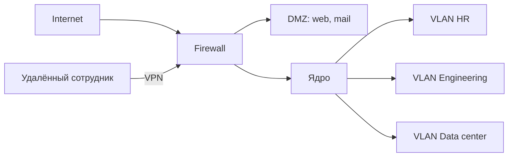

# Корпоративная сеть (enterprise network)

## TL;DR
Сеть внутри одной организации: офисы, дата-центры, удалённые сотрудники, иногда филиалы в разных городах. Управляется одной службой, имеет свою адресную политику, политики безопасности и разделение на сегменты. Соединена с интернетом через контролируемую границу (брандмауэр, прокси).

## Какую проблему решает
Внутри организации нужно: дать сотрудникам доступ к внутренним ресурсам (файлы, приложения, базы), не открыть их наружу, разграничить права (бухгалтерия не должна видеть код), пустить удалённых через VPN, защитить от внешних атак. «Просто LAN» не справляется на масштабе — нужна спроектированная архитектура.

## Как работает
Типичные элементы:
- **Сегментация** через [[VLAN — IEEE 802.1Q]] и/или подсети — разные отделы изолированы.
- **Брандмауэры** на периметре и между сегментами.
- **DMZ** (демилитаризованная зона) для сервисов, видимых снаружи (mail-сервер, веб-сайт компании).
- **VPN** для удалённых сотрудников и связи между офисами.
- **NAC** (Network Access Control), 802.1X — кто пускается в сеть.
- **Прокси и фильтрация** исходящего трафика.
- **AD/LDAP, SSO, MFA** — управление учётками.
- **Мониторинг** (SIEM, NetFlow, IDS/IPS).

## Пример
Компания на 500 сотрудников:
- Офис в Москве: VLAN-сегментация по отделам, всё в подсети 10.0.0.0/8.
- Дата-центр в Питере: подключён к офису через MPLS-VPN или IPsec-туннель.
- Удалённые: подключаются по WireGuard/OpenVPN.
- Внешний веб-сайт: в DMZ.
- Все запросы наружу — через прокси (фильтр URL и DLP).

## Связи
- **Базируется на:** [[Компьютерная сеть]], [[Типы сетей по охвату]].
- **Используется в:** [[VLAN — IEEE 802.1Q]] (сегментация), [[VPN]] (удалённый доступ), [[Брандмауэр]] (периметр).
- **Соседи по уровню:** дата-центр — частный случай корп. сети с акцентом на сервер-к-серверу.
- **Противопоставляется:** домашняя LAN — нет сегментации, обычно одна подсеть; нет AD/SIEM/IDS.

## Подводные камни
- «Корп. сеть = безопасно» — миф. Атаки чаще всего изнутри (фишинг, заражённый ноут). Поэтому современный подход — **zero trust**: никому не доверяем по факту нахождения в сети.
- VLAN — изоляция L2, но **не** замена брандмауэру. L3-trunk между VLAN маршрутизирует трафик.
- BYOD (bring your own device) усложняет: личные устройства не контролируются IT.

## Дальше читать
- [[VLAN — IEEE 802.1Q]] — сегментация.
- [[VPN]] — туннели.
- [[Брандмауэр]] — периметр.
- Tanenbaum, гл. 1, §1.2.5 (стр. PDF 39–41).
