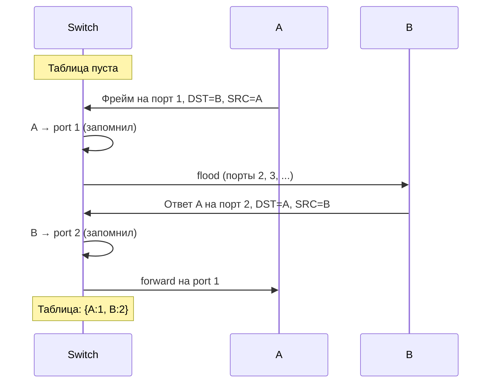

# Мост и обучающийся мост (bridge, learning bridge)

## TL;DR
**Мост** — устройство канального уровня, соединяющее две (или больше) L2-сети и пересылающее фреймы между ними по MAC-адресу. **Обучающийся мост** автоматически строит таблицу `MAC → порт` из наблюдаемого трафика. Многопортовый bridge = современный **switch**.

## Какую проблему решает
Хаб тупо повторяет биты во все порты — это L1-устройство, шумно и не масштабируется. Чтобы **разделить коллизионные домены** и не плодить трафик, нужно устройство, понимающее MAC-адрес и пересылающее **только** в нужный порт. Изначально это были bridge'ы между сегментами (1980-е); потом превратились в multi-port switch'и.

Если конфигурировать таблицу вручную для каждого MAC — сетевой администратор сходит с ума. Поэтому **обучение автоматически**: алгоритм Перлман (Radia Perlman, 1985).

## Как работает

**Forwarding table** в bridge: `MAC → port + age`.

**Алгоритм:**
1. Получил фрейм на порте P:
   - **Запомнил**: SRC MAC → P (с таймстемпом). Это **обучение**.
   - Ищет DST MAC в таблице:
     - **Найдено + порт = P**: filter (отбросить, фрейм уже в нужной сети).
     - **Найдено + порт ≠ P**: forward только в этот порт.
     - **Не найдено**: **flood** во все порты, кроме P.
2. **Aging:** записи устаревают через ~5 минут (default Cisco) — пересоздаются по новому трафику. Это позволяет узлам перемещаться между портами (например, переехал в другой кабинет).

## Пример
- **Малый офис, 1 switch:** 24 порта, ~30 устройств. Switch сам учит таблицу за минуты, дальше работает почти молча.
- **Дата-центр:** ToR-switch имеет таблицы на 100k+ MAC через TCAM-память; учит на скоростях 100+ Gbps.

**Что происходит при unknown unicast:**
- Учится через flood. Это «одноразовое расход полосы», вскоре конкретный MAC выучен.
- При очень частой смене MAC (короткий aging timer + большая сеть) — много flood'а, broadcast-storm-риск.

## Связи
- **Базируется на:** [[Канальный уровень]], [[MAC-адрес]] (на чём учится).
- **Используется в:** [[Коммутируемый Ethernet]] (внутренний механизм switch'а).
- **Соседи по уровню:** [[Spanning Tree Protocol]] — защита от петель в топологии bridge'ей.
- **Противопоставляется:** **хаб** (L1, не учится, всегда flood) и **роутер** (L3, маршрутизация по IP, не по MAC).

## Подводные камни
- **MAC-flooding атака:** злоумышленник заливает switch фейковыми MAC'ами, таблица переполняется, switch начинает flood'ить **всё** → сниффинг трафика. Современные switch'и имеют port security.
- **Loop в топологии без STP** — катастрофа: фрейм бесконечно множится на flood'ах, broadcast-storm. Поэтому Perlman изобрёл [[Spanning Tree Protocol]].
- Таблица **не делится** по VLAN сама собой — нужен один из VLAN-aware-механизмов (IVL — Independent VLAN Learning или SVL — Shared).
- В дата-центрах с тысячами VM **MAC mobility** (VM мигрирует) ломает простой aging — нужны GARP, EVPN-сигнализация.

## Дальше читать
- [[Коммутируемый Ethernet]] — практическое применение.
- [[Spanning Tree Protocol]] — защита от петель.
- [[Hub vs Switch vs Router vs Gateway]] — где bridge среди других устройств.
- Tanenbaum, гл. 4, §4.7.1–4.7.2 (стр. PDF 387–391).
