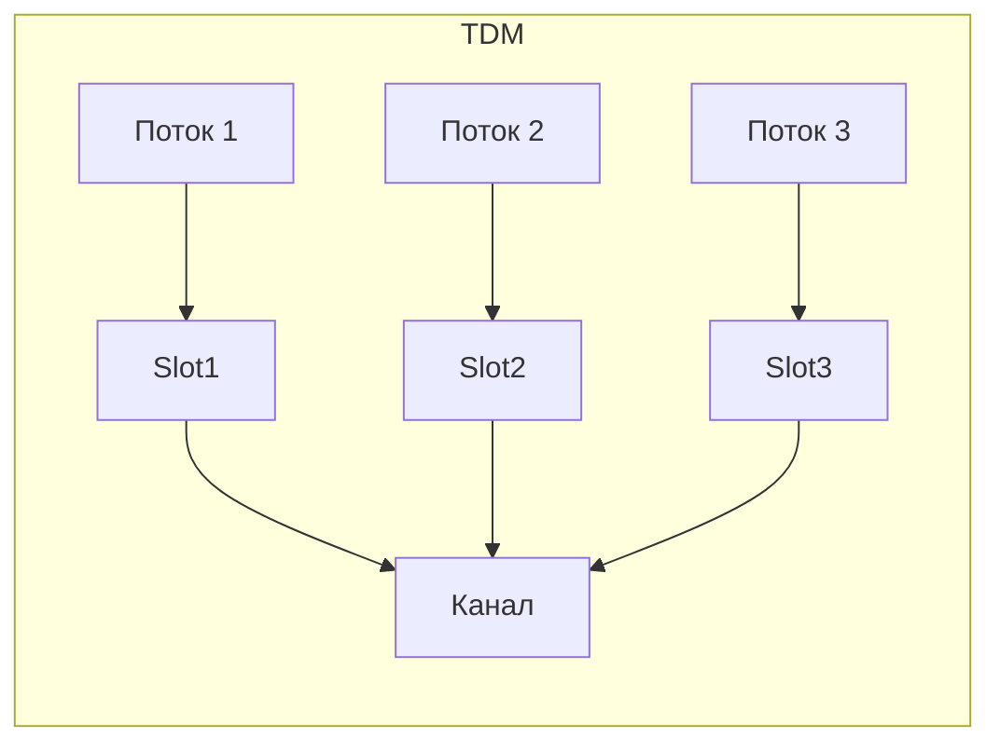

# Мультиплексирование (multiplexing)

## TL;DR
Способ передать **много независимых потоков** по **одному физическому каналу**, разделяя его по времени, по частоте, по коду или по длине волны. Без мультиплексирования каждому соединению нужен свой провод/частота — что бы делало большую сеть невозможной.

## Какую проблему решает
Ресурс канала (полоса) фиксирован, а пользователей — миллионы. Нужны методы делить общий ресурс между множеством потоков с минимальным взаимным влиянием. От этого зависит экономика и масштаб любой сети.

## Как работает

| Вид | Делим по... | Где применяется |
|---|---|---|
| **TDM** (Time Division Multiplexing) | времени — каждому потоку свой временной слот | E1/T1, GSM, классический телефонный backbone |
| **FDM** (Frequency Division Multiplexing) | частоте — каждому свой подканал | аналоговое радио, кабельное ТВ, DOCSIS |
| **OFDM** (Orthogonal FDM) | частоте, ортогональные поднесущие | Wi-Fi, LTE/5G, DOCSIS 3.1, ADSL |
| **WDM/DWDM** (Wavelength Division Multiplexing) | длине волны на оптоволокне | магистрали интернета |
| **CDMA** (Code Division Multiple Access) | псевдослучайному коду | 3G UMTS, GPS |
| **SDM** (Spatial Division Multiplexing) | пространству (направленные антенны, MIMO) | Wi-Fi 5/6/7, 5G massive MIMO |

**Гибриды:**
- GSM использует **FDMA + TDMA**: спектр поделён на 200-кГц-каналы (FDM), каждый канал — на 8 временных слотов (TDM).
- LTE/5G — **OFDMA** (мультиплексное расширение OFDM на множество пользователей).

## Пример
- **DOCSIS 3.0:** FDM делит кабельный спектр на 6/8 МГц-каналы. На каждом 64-QAM (~36 Мбит/с) или 256-QAM (~39 Мбит/с) с overhead → ~27/39 Мбит/с полезных (Tanenbaum, стр. PDF 212).
- **GSM-сота:** 124 канала по 200 кГц (FDM), каждый 8 пользователей (TDM) → 992 одновременных голосовых вызова в соте (Tanenbaum, гл. 2, §2.6.4).
- **Магистральный DWDM:** 80 длин волн (1530–1565 нм), каждая 100 Гбит/с → 8 Тбит/с в одном волокне.

## Связи
- **Базируется на:** [[Среда передачи данных]] — мультиплексируем именно её ёмкость.
- **Используется в:** [[OFDM]] (важнейший частный случай), [[GSM]] (FDMA+TDMA), [[Расширение спектра — DSSS]] (база для CDMA), [[Оптоволокно]] (WDM).
- **Соседи по уровню:** [[Цифровая модуляция — амплитуда-частота-фаза]] — модуляция работает внутри каждого подканала мультиплекса.
- **Противопоставляется:** «один поток — один канал» — экономически нежизнеспособно при большом числе пользователей.

## Подводные камни
- В TDM пустые слоты «просто пустые» — если поток замолчал, ёмкость не достаётся другим. Современные сети используют **статистический мультиплекс** (TDM с переподпиской) — пакеты делят слоты динамически.
- В FDM **защитные интервалы** (guard bands) между подканалами — это потерянная полоса.
- OFDM решает обе проблемы: ортогональные поднесущие не нуждаются в защитных интервалах, и можно динамически перекидывать поднесущие между пользователями (OFDMA).

## Дальше читать
- [[OFDM]] — основа современных беспроводных систем.
- [[GSM]] — пример комбинации FDMA + TDMA.
- Tanenbaum, гл. 2, §2.4.4 (стр. PDF 158–166).
