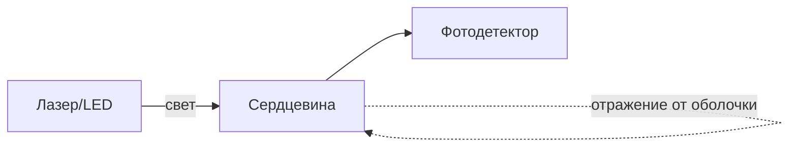

# Оптоволокно (optical fiber)

## TL;DR
Стеклянная (или пластиковая) нить толщиной с человеческий волос, по которой передаётся **свет**. За счёт полного внутреннего отражения свет идёт внутри сердцевины, отражаясь от оболочки. Оптоволокно даёт **колоссальную полосу пропускания** (терабиты), очень низкое затухание (можно тянуть десятки и сотни км без усиления) и иммунитет к электромагнитным помехам. Основа всех современных магистралей.

## Какую проблему решает
Меди достаточно для коротких расстояний и средних скоростей, но магистрали (между городами, между дата-центрами) требуют доставки терабит на десятки и сотни км. По меди такое теряется до затухания за единицы км. Свет в стекле — гораздо лучшее физическое решение: волна частоты ~200 ТГц, потери ~0.2 дБ/км, нет ЭМ-помех.

## Как работает

**Полное внутреннее отражение:** сердцевина (core) имеет показатель преломления n₁ выше, чем оболочка (cladding) с n₂ < n₁. Луч, попадающий под углом больше критического, отражается от границы и не покидает сердцевину.

**Два главных типа:**

| Тип | Диаметр core | Расстояние | Источник |
|---|---|---|---|
| **Многомодовое (MMF)** | 50–62.5 мкм | до сотен м – 2 км | LED, VCSEL |
| **Одномодовое (SMF)** | 8–10 мкм | десятки–сотни км | лазер |

В многомодовом свет идёт несколькими «модами» (траекториями) — это даёт **modal dispersion** и ограничивает скорость/дистанцию. Одномодовое имеет узкую сердцевину, по сути одну моду — отсюда стабильный сигнал и большие дистанции.

**Окна прозрачности:**
- **850 нм** — короткие дистанции, MMF, дешёвые VCSEL-источники.
- **1310 нм** — средние, низкая дисперсия.
- **1550 нм** — дальние, минимум потерь (~0.2 дБ/км), эрбиевые усилители (EDFA).

**WDM (см. [[Мультиплексирование]]):** в одно волокно можно посадить десятки длин волн — каждая несёт независимый сигнал. Так получают терабиты в одной нитке.

## Пример
- **Магистраль межгород:** одномодовое волокно, длина волны 1550 нм, EDFA через каждые ~80 км; DWDM позволяет 80+ каналов по 100 Gbps в одном волокне.
- **FTTH (fiber to the home):** одномодовое + GPON — общий сплиттер на 32–64 абонентов, 2.5/10 Gbps вниз.
- **Внутри дата-центра:** короткие MMF-патчи 850 нм между свитчами.

## Связи
- **Базируется на:** [[Среда передачи данных]] — частный случай.
- **Используется в:** [[Сети широкополосного доступа]] (FTTH), [[Мультиплексирование]] (WDM), магистралях интернета.
- **Соседи по уровню:** [[Витая пара]] (проигрывает в скорости/дистанции), [[Коаксиальный кабель]] (старый соперник на магистралях).
- **Противопоставляется:** медь — оптика выигрывает по полосе и затуханию, проигрывает в стоимости активного оборудования и установки.

## Подводные камни
- Оптоволокно **хрупкое**: радиус изгиба ограничен (изгиб портит mode — потеря сигнала или обрыв).
- Соединение требует точной юстировки и сваривания (fusion splicer) или специальных коннекторов (LC, SC, MTP).
- «Оптика — самая быстрая» — узким местом обычно становится **электроника** (трансивер, switch fabric), а не само волокно.
- В FTTH-сплиттер-системе абоненты делят полосу downstream (PON) — это shared medium на оптике.

## Дальше читать
- [[Мультиплексирование]] — WDM/DWDM как основа большой полосы.
- [[Сети широкополосного доступа]] — FTTH как класс.
- Tanenbaum, гл. 2, §2.1.5 (стр. PDF 127–133).
