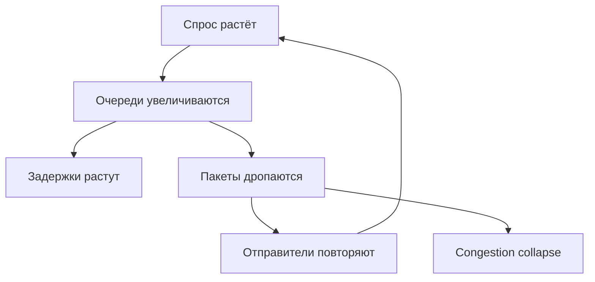

# Перегрузка сети (network congestion)

## TL;DR
Состояние, когда **спрос на ёмкость сети превышает её способность** обслуживать. Очереди в маршрутизаторах растут → задержки растут → пакеты **сбрасываются** (drop tail) → отправители повторяют → ещё больше нагрузки. Без управления это даёт **congestion collapse** — полезный throughput падает почти до нуля. Управляется AQM на маршрутизаторах + congestion control на хостах (TCP).

## Какую проблему решает
Сеть с конечной ёмкостью + миллионы независимых отправителей = неизбежные пиковые нагрузки. Без механизма ограничения нагрузка коллапсирует сама себя: чем больше попыток, тем больше потерь, тем больше повторов, тем хуже всем.

**Перегрузка ≠ saturation линка.** Можно быть на 100% saturation без congestion (если ёмкость = спрос). Congestion начинается, когда **очереди** растут без потолка.

## Как работает

**Жизненный цикл перегрузки:**

**Точки контроля:**

1. **На маршрутизаторе:**
   - **Drop tail:** простейший — переполнился буфер, дропаем хвост.
   - **AQM (Active Queue Management):** превентивный drop ([[RED и AQM]]) до полного заполнения.
   - **ECN ([[ECN]]):** маркируем пакеты как «congestion experienced» вместо drop.

2. **На отправителе:**
   - **Congestion control в TCP:** AIMD, slow start, fast retransmit, CUBIC, BBR.
   - **Reactive vs proactive:** реакция на потерю vs упреждающее замедление по сигналам.

3. **На сети:**
   - **Traffic shaping** ([[Token bucket]], [[Leaky bucket]]) — сглаживание исходящего трафика на edge.
   - **Admission control** — отказ принимать новый трафик при перегрузке (в IntServ).

## Пример
**Скачивание файла, провайдер перегружен:**
- Сервер шлёт пакеты с 100 Мбит/с.
- На промежуточном линке провайдера ёмкость 50 Мбит/с, входящих 80 Мбит/с (от тебя + других пользователей).
- Очередь растёт → задержка растёт.
- При полном буфере — drop. TCP видит потерю → срезает cwnd, замедляется.
- Все отправители «договариваются» через AIMD до устойчивого состояния, где сумма скоростей ≈ ёмкость.

## Связи
- **Базируется на:** [[Сетевой уровень]] (где живёт), теория очередей (queueing theory).
- **Используется в:** [[Token bucket]], [[Leaky bucket]], [[RED и AQM]], [[ECN]] — механизмы; [[TCP]] (congestion control на L4).
- **Соседи по уровню:** **flow control** на L4 — другая задача (получатель не утонул); congestion control — про сеть.
- **Противопоставляется:** «больше пакетов = быстрее доставка» — наивное заблуждение.

## Подводные камни
- **Bufferbloat** — слишком большие буферы в маршрутизаторах. Drop tail при больших буферах → большие задержки до drop'а → TCP не реагирует вовремя. Решение — AQM (CoDel, fq_codel в современном Linux).
- **Congestion collapse 1986:** интернет реально коллапсировал в 1986 г. до изобретения Van Jacobson'ом TCP congestion control.
- В современных DC с low-latency требованиями (RDMA, AI-обучение) перегрузка катастрофична — отсюда DCQCN, PFC, ECN-aware протоколы.

## Дальше читать
- [[Token bucket]], [[Leaky bucket]], [[RED и AQM]], [[ECN]] — механизмы.
- [[TCP]] — главный congestion-control на L4.
- Tanenbaum, гл. 5, §5.3 (стр. PDF 445–463).
