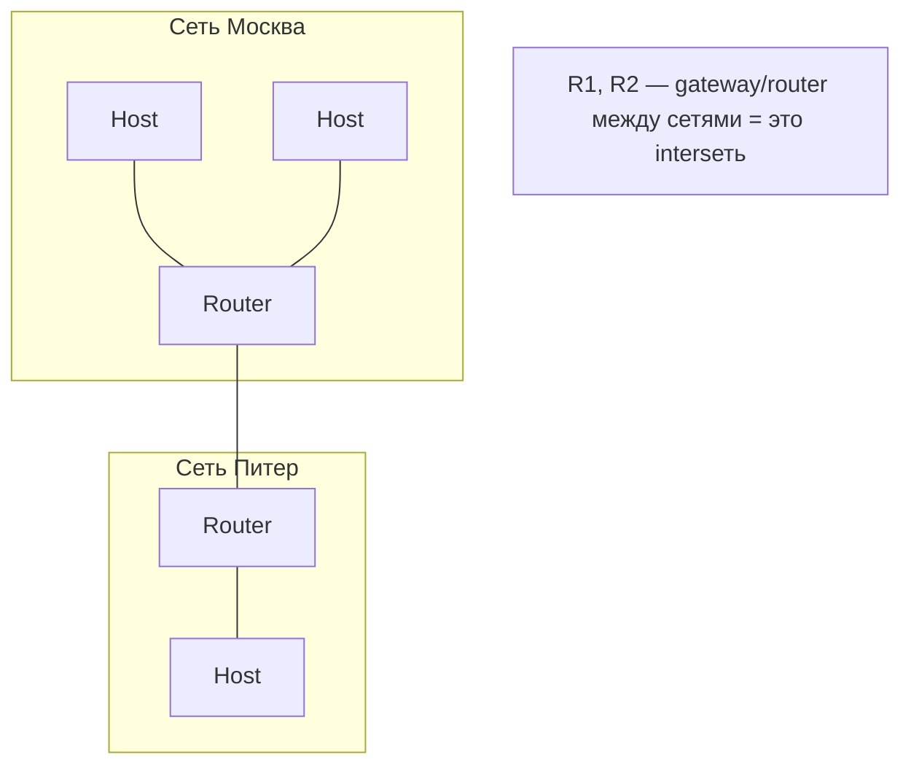

# Подсеть и интерсеть

## TL;DR
**Подсеть (subnet, communication subnet)** — у Tanenbaum'а: «всё, что несёт пакеты» = линии передачи + коммутирующие элементы (маршрутизаторы), без хостов. **Интерсеть (internetwork)** — соединение нескольких сетей через **шлюзы/маршрутизаторы**. Слово «интернет» (с большой буквы) — конкретный, исторически сложившийся internetwork.

## Какую проблему решает
Чёткие термины помогают строить иерархическую картину:
- Хост (компьютер пользователя) — отдельно от сети.
- Подсеть — инфраструктура переноса.
- Сеть = подсеть + хосты.
- Интерсеть = много сетей, соединённых на L3.

Без этих терминов разговор о «сети» расплывается — что именно мы обсуждаем?

## Как работает

**Tanenbaum в §1.3.5 (стр. 48–51) определяет:**

**Подсеть:**
- **Линии передачи** (трубы, по которым идут биты).
- **Коммутирующие элементы** (специальные computers — маршрутизаторы — которые соединяют ≥2 линий и пересылают пакеты).
- Хостов **нет** в подсети по определению.

**Сеть:**
- Подсеть + хосты, использующие её.

**Интерсеть:**
- Несколько разнородных сетей, соединённых маршрутизаторами/шлюзами.
- «Heterogeneous» — разные L1/L2-технологии (Ethernet + Wi-Fi + SONET + DOCSIS).
- L3 (IP) — общий язык, делающий интерсеть **possible**.

**Шлюз vs маршрутизатор:**
- **Маршрутизатор** — на L3, по IP.
- **Шлюз** в широком смысле — любое устройство, переводящее между **разнородными** системами. На L7 — application gateway.
- В IP-эпоху термины почти синонимичны (default gateway = default router).

## Пример
- **LAN офиса** = одна сеть (один Ethernet-сегмент с несколькими хостами).
- **Корп. WAN** = несколько LAN, соединённых маршрутизаторами → интерсеть.
- **Интернет** = десятки тысяч AS-сетей, соединённых через [[BGP]] → крупнейший публичный internetwork.

**Внутри одной AS** часто говорят «наша сеть» в смысле одного административного домена; формально это тоже internetwork (много LAN/WAN-сегментов).

## Связи
- **Базируется на:** [[Компьютерная сеть]] (фундамент), [[Маршрутизатор]] (главный узел подсети).
- **Используется в:** [[Интернет — архитектура]] (главный пример), [[IP-адресация и CIDR]] (subnet с большой буквы).
- **Соседи по уровню:** **subnet в IPv4-смысле** = группа адресов под общим префиксом (см. [[IP-адресация и CIDR]]). **Не путать** с «communication subnet» Tanenbaum'а!
- **Противопоставляется:** **multi-access network** (LAN, эфир) — все хосты делят один сегмент. **Internetwork** соединяет такие сегменты через L3.

## Подводные камни
- **«Subnet» в Tanenbaum'е (communication subnet)** ≠ **«subnet» в IPv4** (адресный блок 10.0.0.0/24). Первый — про хосты-vs-инфраструктура; второй — про адресацию. К сожалению, термины омонимичны.
- В современных DC граница «сеть/интерсеть» размыта — VXLAN-overlay'и поверх L3-fabric делают L2-сеть, которая физически — internetwork.

## Дальше читать
- [[IP-адресация и CIDR]] — другое значение «подсети».
- [[Интернет — архитектура]] — главный internetwork.
- Tanenbaum, гл. 1, §1.3.5–1.3.6 (стр. PDF 48–53).
