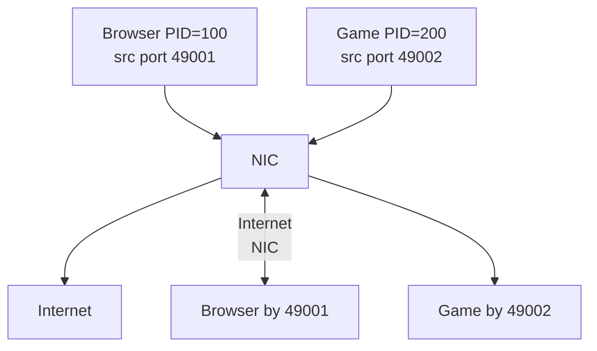

# Порт

## TL;DR
**16-битный идентификатор** конкретного приложения (или сокета) на хосте. На хосте может работать тысячи приложений; IP идентифицирует **хост**, порт — **процесс/сокет внутри хоста**. Полный 5-tuple `(src IP, src port, dst IP, dst port, protocol)` уникально идентифицирует L4-поток. Диапазоны: 0–1023 well-known, 1024–49151 registered, 49152–65535 dynamic/ephemeral.

## Какую проблему решает
На одном хосте тысячи приложений хотят сети: браузер, игра, почта, бэкап, DNS-resolver. IP даёт только адрес хоста — этого мало. Нужен **второй уровень адресации внутри хоста**. Порт — это он.

## Как работает

**Диапазоны (IANA):**
| Диапазон | Имя | Применение |
|---|---|---|
| **0–1023** | well-known | стандартные сервисы (требует root для bind в Linux) |
| **1024–49151** | registered | зарезервированные у IANA |
| **49152–65535** | dynamic / ephemeral | автоматически выдаётся ОС для исходящих сессий |

**Стандартные well-known:**
- 22 SSH
- 25 SMTP
- 53 DNS
- 80 HTTP
- 110 POP3
- 143 IMAP
- 443 HTTPS
- 3306 MySQL
- 5432 PostgreSQL
- 6379 Redis

**TCP и UDP — отдельные namespace:** TCP-53 и UDP-53 — разные «порты» (DNS работает на обоих).

**На клиентской стороне:** ОС выбирает **ephemeral port** автоматически при `connect()`. Linux default: 32768–60999.

ОС держит **socket table**: `(local IP, local port, remote IP, remote port, proto) → socket FD → process`. Каждый входящий пакет смотрит этот lookup.

## Пример
- **HTTPS-сервер на 443:** одновременно обслуживает 10 000 клиентов.
  - Все 10 000 соединений: dst port = 443 (server).
  - 10 000 разных src port (ephemeral у клиентов).
  - + разные src IP.
  - Каждое соединение — уникальный 5-tuple, своё состояние в kernel.
- **NAT** (см. [[NAT]]) использует именно этот механизм: разные внутренние хосты получают разные публичные src ports.

## Связи
- **Базируется на:** [[Транспортный уровень]] (где он живёт), [[Сокеты Беркли]] (API).
- **Используется в:** [[TCP]], [[UDP]] (поле в заголовке), [[NAT]] (PAT через перезапись).
- **Соседи по уровню:** [[IP-адресация и CIDR]] — другая часть 5-tuple.
- **Противопоставляется:** **L7-routing** (по URL/SNI) — намного гибче, но дороже; порт — простое L4.

## Подводные камни
- **`bind` < 1024 в Linux требует root** или `CAP_NET_BIND_SERVICE`. Для production-серверов часто решают через reverse proxy (nginx как root → backend на 8080 как обычный пользователь).
- **TIME_WAIT** на закрытом TCP-соединении удерживает (local_ip, local_port, remote_ip, remote_port) → дублирующий connect не сработает 60–120 с. SO_REUSEADDR.
- **Port exhaustion:** на загруженном клиенте 50000 ephemeral портов могут кончиться → новые connect() failли. Решения — SO_REUSEPORT, увеличение range, NAT-pool у балансировщика.

## Дальше читать
- [[TCP]], [[UDP]] — основные потребители.
- [[Сокеты Беркли]] — API.
- Tanenbaum, гл. 6, §6.2.1 (стр. PDF 577–580).
