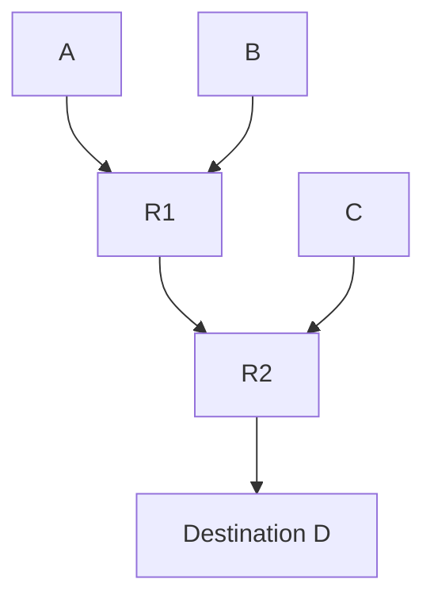

# Принцип оптимальности маршрутизации

## TL;DR
**Если маршрутизатор J на оптимальном пути от I к K, то путь от J до K — тоже оптимальный.** Из этого следует, что множество всех оптимальных путей от всех источников к одному получателю **образует дерево** (sink tree, дерево к стоку). Это математическая основа всех distributed routing-алгоритмов.

## Какую проблему решает
Без принципа оптимальности маршрутизация была бы интрактабельной задачей: для каждой пары (источник, получатель) считать путь отдельно. Принцип позволяет **декомпозировать**: каждый маршрутизатор хранит только «куда идти к каждому destination» — и этого достаточно, потому что подпуть оптимального пути сам оптимален.

## Как работает
**Доказательство (от противного):**
- Допустим, путь I→J→K оптимален.
- Но путь J→K **не** оптимален → существует J→K' лучше.
- Тогда I→J→K' (тот же I→J + новый J→K') лучше I→J→K.
- Противоречит оптимальности I→J→K.

**Следствие — sink tree:**
- Соберём оптимальные пути от всех узлов сети к одному получателю D.
- Они не могут содержать петель (петля удлиняет путь).
- Они образуют **дерево** с корнем D — `sink tree`.

## Пример
В [[Алгоритм Дейкстры]] каждый узел хранит «next-hop к любому destination». Это и есть sink tree, построенное относительно его. Когда маршрутизатор пересылает пакет, он смотрит destination и идёт к **своему next-hop'у** — дальше по дереву это «не его проблема», подпуть оптимален по принципу.

## Связи
- **Базируется на:** теория графов, общая оптимизация.
- **Используется в:** [[Алгоритм Дейкстры]] (находит sink tree), [[Distance Vector Routing]], [[Link State Routing]] — все опираются на принцип.
- **Соседи по уровню:** Bellman-Ford алгоритм — другой способ найти оптимальные пути.
- **Противопоставляется:** методы без декомпозиции (например, source routing) — там принцип не нужен.

## Подводные камни
- Принцип верен **в стационарной сети**. При изменениях топологии оптимальность временно нарушается, пока алгоритм не сошёлся.
- В **policy-based routing** (BGP) «оптимальность» — не shortest path, а с учётом политики оператора. Принцип формально не применим.

## Дальше читать
- [[Алгоритм Дейкстры]] — конструктивное использование.
- [[Distance Vector Routing]] — distributed-вариант.
- Tanenbaum, гл. 5, §5.2.1 (стр. PDF 422–423).
