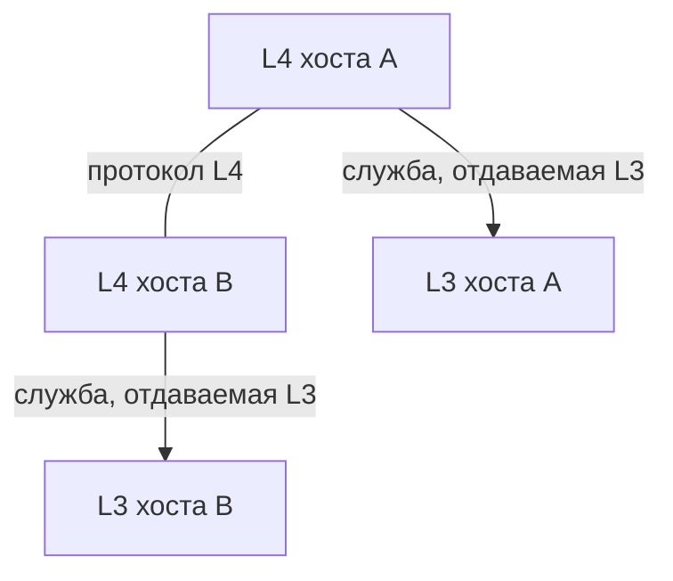

# Протокол vs служба

## TL;DR
**Служба (service)** — что уровень N **обещает** уровню N+1: набор операций (примитивов), которые тот может вызвать. **Протокол (protocol)** — как уровень N **общается с собой** на другой машине, чтобы это обещание выполнить. Служба — интерфейс. Протокол — реализация.

## Какую проблему решает
Без чёткого разделения интерфейса и реализации заменить технологию (например, Wi-Fi на Ethernet) — значит переписать половину стека. Если же L2 даёт L3 одну и ту же **службу** «передай фрейм», то менять можно **протокол** под капотом — L3 ничего не заметит.

## Как работает
- **Служба** определяется списком **примитивов** (см. [[Примитив службы]]): CONNECT, SEND, RECEIVE, DISCONNECT и т.п. Каждый примитив имеет параметры и семантику (синхронный/асинхронный, блокирующий/неблокирующий).
- **Протокол** — формат сообщений между равными уровнями + правила обмена (state machine).

Служба — **вертикальная** (между уровнями одного хоста через интерфейс). Протокол — **горизонтальная** (между одинаковыми уровнями двух хостов).

## Пример
**TCP-служба:** «надёжный байтовый поток». Примитивы — CONNECT, SEND, RECEIVE, DISCONNECT.
**TCP-протокол:** заголовок с seq/ack, три рукопожатия, slow start, ретрансмиссии — то, как TCP **внутри** обеспечивает обещанную службу.

Приложение, использующее TCP, не знает про seq и cwnd — оно знает, что «писал — получишь там, в порядке, без потерь, без дублей». Это и есть служба.

## Связи
- **Базируется на:** [[Уровневая архитектура]] — без слоёв нет понятий «служба» и «протокол».
- **Используется в:** [[Соединение vs без соединения]], [[Надёжность службы]] — характеристики, описывающие службу.
- **Соседи по уровню:** [[Примитив службы]] — конкретный формат описания службы.
- **Противопоставляется:** ошибочно сводить «службу» к «протоколу». TCP-протокол стабилен, но службы поверх него (HTTP, SSH, SMTP) — разные.

## Подводные камни
- Имя «TCP/IP» обозначает **протоколы**. Люди часто говорят «TCP-служба», подразумевая HTTP/HTTPS/etc., — это неточно.
- Один и тот же протокол может **предоставлять** разные службы за счёт опций (например, TCP с/без TLS — разные службы для приложения).
- На каждом уровне есть и своя служба (вверх), и свой протокол (вбок). Не путай направления.

## Дальше читать
- [[Примитив службы]] — формальное описание операций.
- [[Соединение vs без соединения]] и [[Надёжность службы]] — две главные оси характеристик службы.
- Tanenbaum, гл. 1, §1.5.4–1.5.5 (стр. PDF 85–89).
