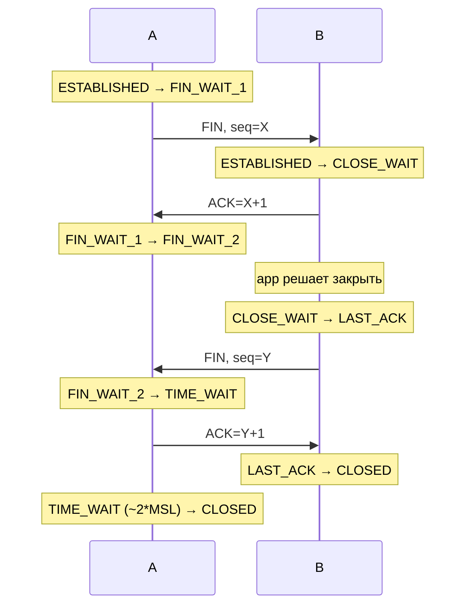

# Разрыв соединения (TCP teardown)

## TL;DR
TCP-соединение закрывается **симметрично** через 4 сегмента: каждая сторона шлёт **FIN** (я закончил отправку) и получает **ACK** этого FIN. Возможно состояние **полузакрытое** — одна сторона FIN'нула, вторая ещё шлёт. Аварийный разрыв — **RST**: «прерви немедленно, без рукопожатия». **TIME_WAIT** ~60-120 с после нормального закрытия — защита от старых сегментов.

## Какую проблему решает
Two-army problem (Tanenbaum §6.2.3): в общем случае нельзя гарантированно договориться о синхронном завершении в ненадёжной сети. TCP идёт компромиссным путём: каждая сторона **независимо** отправляет FIN, оператор может оставить соединение полузакрытым (получать ещё, но не отправлять).

## Как работает

**Нормальное закрытие (4-way handshake):**

**Полузакрытое состояние:** A отправил FIN, но B продолжает отправлять — это **legal**. Применяется, например, для `SHUT_WR` без полного закрытия.

**Аварийный разрыв (RST):**
- Получатель получил сегмент на закрытое соединение → шлёт RST.
- Приложение вызвало `close()` с SO_LINGER=0 → RST вместо FIN.
- Резкое прерывание без TIME_WAIT.

**TIME_WAIT** длительностью **2 × MSL** (Maximum Segment Lifetime, обычно ~60–120 с):
- Защита от **поздних** сегментов от старого соединения, которые могли бы быть приняты новым с тем же 5-tuple.
- На загруженных серверах TIME_WAIT'ы могут копиться → исчерпание портов. **SO_REUSEADDR**, `tcp_tw_reuse` — облегчение.

## Пример
**HTTP без keep-alive:**
- Клиент: GET / → ответ → клиент `close()` → FIN.
- Сервер ACK; через мгновение тоже close → FIN.
- Клиент TIME_WAIT.
- При высокой нагрузке (1000 коннектов/с) — десятки тысяч TIME_WAIT'ов на клиенте → port exhaustion. Поэтому HTTP/1.1 keep-alive по умолчанию.

## Связи
- **Базируется на:** [[TCP]], [[Three-way handshake]] (открытие — пара).
- **Используется в:** [[TCP — состояния]] — конечный автомат.
- **Соседи по уровню:** **HTTP keep-alive**, **WebSocket** — попытки минимизировать teardown overhead.
- **Противопоставляется:** UDP — нет соединения, нет teardown.

## Подводные камни
- **CLOSE_WAIT накапливается** = bug в приложении: оно **не вызвало `close()`** на своих сокетах. Утечка дескрипторов.
- **TIME_WAIT на сервере vs на клиенте** — обычно на стороне, кто **активно** закрывает (initiator). Серверы стараются не быть инициатором.
- **RST после close()** — может потерять данные, которые ещё в send buffer'е. SO_LINGER регулирует.

## Дальше читать
- [[TCP — состояния]] — детальный автомат.
- [[Three-way handshake]] — пара открытия.
- Tanenbaum, гл. 6, §6.2.3 (стр. PDF 586–590).
