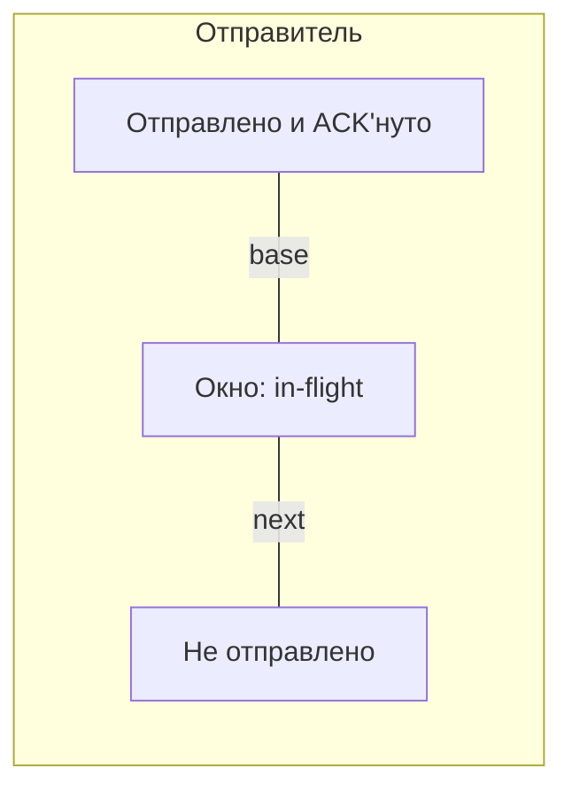

# Скользящее окно (sliding window)

## TL;DR
Способ передавать **несколько фреймов одновременно** без ожидания каждого ACK. Отправитель имеет окно — диапазон номеров seq, которые **отправлены, но не подтверждены**. Получатель имеет своё окно — диапазон, который **готов принять**. По мере прихода ACK'ов окно отправителя «сдвигается» вперёд. Это резко поднимает утилизацию канала на больших RTT.

## Какую проблему решает
[[Stop-and-Wait]] утилизирует канал с RTT = 50 мс на доли процента. Решение — позволить **несколько фреймов в полёте** (in-flight). Сколько? В идеале — столько, чтобы канал не простаивал, то есть **bandwidth × RTT** (BDP — bandwidth-delay product). Скользящее окно — фреймворк, реализующий это.

## Как работает

**Сторона отправителя:**
- **W** — размер окна (max in-flight).
- **base** — самый старый отправленный, не подтверждённый.
- **next** — следующий для отправки.
- Можно отправлять, пока `next < base + W`.
- Получив ACK для `base` → `base++` (окно сдвинулось).
- Timeout → переотправка по схеме (Go-Back-N или Selective Repeat).

**Сторона получателя:**
- Своё окно ожидаемых seq.
- **Размер окна получателя = 1** → [[Go-Back-N]] (принимает только в порядке).
- **Размер окна получателя > 1** → [[Selective Repeat]] (принимает out-of-order, буферизует).

**Размеры seq и окна:**
- seq идёт по модулю N (например, 4 бита → N=16).
- Чтобы избежать неоднозначности при потерях ACK'ов:
  - Go-Back-N: W ≤ N − 1.
  - Selective Repeat: W ≤ N / 2.

## Пример

**Канал 1 Гбит/с, RTT 50 мс:**
- BDP = 1e9 × 50e-3 = 50 Мбит.
- Фрейм 1500 байт = 12 000 бит.
- Идеальный размер окна: 50 Мбит / 12 000 = **~4167 фреймов в полёте**.
- При W = 4167 канал утилизирован на 100%; при W = 1 — 0.024%.

**TCP** реализует скользящее окно поверх IP-сегментов. Поле **window size** в заголовке (16 бит → max 64 КБ; с **window scale** — до гигабайт) — это размер окна получателя, ограничивает отправителя.

## Связи
- **Базируется на:** [[ARQ]] (общий принцип), [[Stop-and-Wait]] (вырожденный случай W=1).
- **Используется в:** [[Go-Back-N]], [[Selective Repeat]] (две основные реализации); [[TCP]] (на уровне L4).
- **Соседи по уровню:** [[Piggybacking]] — оптимизация ACK'ов; flow control vs congestion control в TCP.
- **Противопоставляется:** Stop-and-Wait — никогда не утилизирует длинный канал.

## Подводные камни
- На очень больших RTT (спутник, межконтинентальная связь) BDP огромный — нужны **большие окна**. Старые ОС с 16-битным TCP window часто были бутылочным горлышком; window scale (RFC 1323) решает.
- Окно **получателя** — про buffer; окно **отправителя** — про unacked. Не путай с **congestion window** (cwnd) в TCP — это про сеть, не про канал/получателя.
- Размер окна должен расти **медленно** при congestion (slow start, AIMD), иначе сеть перегружается. См. [[TCP — slow start]].

## Дальше читать
- [[Go-Back-N]], [[Selective Repeat]] — конкретные реализации.
- [[TCP]] — главный практический пример.
- Tanenbaum, гл. 3, §3.4 (стр. PDF 277–296).
