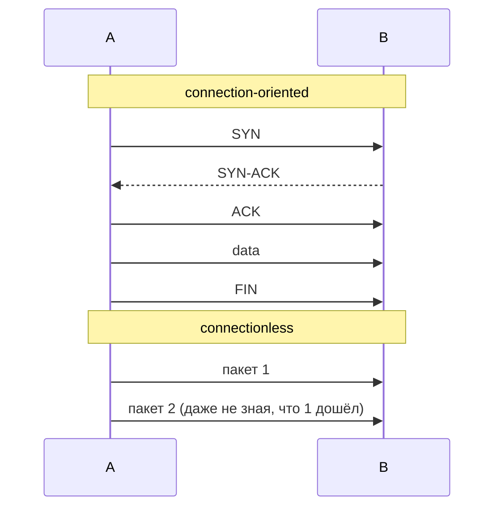

# Соединение vs без соединения (connection-oriented vs connectionless)

## TL;DR
Две модели обмена данными. **С установлением соединения**: сначала «алло» (handshake), потом обмен в установленном контексте, потом «пока». **Без соединения**: пакеты летят независимо, как открытки, состояние нигде не хранится. TCP — пример первого, UDP — второго.

## Какую проблему решает
Иногда диалог требует **контекста**: знать, какой пакет потерялся, в каком порядке, не дублирован ли. Контекст логично хранить **где-то** — в установленном соединении. Иногда наоборот, контекст вреден: ради простоты, скорости, мультикаста, отказоустойчивости лучше каждый пакет сделать самодостаточным.

## Как работает
**Connection-oriented:**
1. **Установление** — обмен сообщениями для договора о параметрах (SYN/SYN-ACK/ACK у TCP).
2. **Передача** — каждое сообщение идёт в контексте: знаем seq, ack, window.
3. **Разрыв** — обе стороны корректно закрывают (FIN/ACK).

**Connectionless:**
1. Шлёшь пакет.
2. Всё.

Пакет в connectionless содержит **полный** адрес назначения и достаточно метаданных для самостоятельной обработки.

## Пример
- **Connection-oriented:** скачивание файла по TCP. Установили соединение — гарантируется порядок, нет дублей, нет потерь.
- **Connectionless:** DNS-запрос по UDP. Один маленький запрос, один маленький ответ. Заводить соединение ради 50 байт — расточительно.
- **Гибрид:** QUIC. На вид — без соединения (UDP), внутри — рукопожатие, миграция соединения и т.д.

## Связи
- **Базируется на:** [[Протокол vs служба]] — это характеристика **службы**.
- **Используется в:** [[TCP]] (CO), [[UDP]] (CL), [[Datagram subnet vs virtual-circuit subnet]] (то же различие на сетевом уровне).
- **Соседи по уровню:** [[Надёжность службы]] — другая независимая ось.
- **Противопоставляется:** одна модель не «лучше» другой. Они для разных задач.

## Подводные камни
- Connection-oriented ≠ надёжный. ATM — connection-oriented, но без гарантий доставки. См. [[Надёжность службы]] — это **независимая** ось.
- «Соединение» — это виртуальная конструкция. На IP-уровне TCP-соединения **физически нет**. Оно живёт только как состояние в ОС обеих сторон.
- В QUIC «соединение» переживает смену IP клиента — у TCP в той же ситуации соединение порвётся.

## Дальше читать
- [[Надёжность службы]] — почему это независимое свойство.
- [[Datagram subnet vs virtual-circuit subnet]] — та же дихотомия на сетевом уровне.
- [[TCP]], [[UDP]] — главные представители каждой модели.
- Tanenbaum, гл. 1, §1.5.3 (стр. PDF 82–85).
