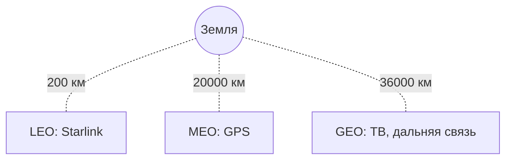

# Спутники связи: GEO, MEO, LEO

## TL;DR
Три класса спутников по высоте орбиты: **GEO** (~35 786 км над экватором, неподвижны над точкой Земли), **MEO** (5 000–20 000 км, обходят Землю за часы), **LEO** (160–2 000 км, обходят за ~90 мин). Чем ниже орбита, тем меньше задержка и затухание, но тем больше нужно спутников для глобального покрытия и тем чаще они «уходят» за горизонт.

## Какую проблему решает
В удалённых местах (океаны, тайга, горы), где нет проводной инфраструктуры, спутники остаются единственным каналом связи. Также для морских судов, авиации, экстренных служб. Разные орбиты — это разные компромиссы между задержкой, ёмкостью и сложностью развёртывания.

## Как работает

| Класс | Высота | Период | Задержка (RTT min) | Покрытие |
|---|---|---|---|---|
| **GEO** | 35 786 км (экватор) | 24 ч | ~270 мс (по Tanenbaum, стр. 219) | 3 спутника покрывают всю Землю кроме полюсов |
| **MEO** | 5 000–15 000 км | ~6 ч | ~120 мс | ~10 спутников для глобального |
| **LEO** | 160–2 000 км | ~90 мин | 40–150 мс (по Tanenbaum, стр. 220); Starlink современнее даёт 30–50 мс | сотни/тысячи спутников |

**GEO:**
- Стационарны относительно поверхности (один и тот же оборот вокруг Земли = 24 ч).
- Один спутник «видит» 1/3 Земли.
- Задержка в **обе стороны** ≥ 240 мс — заметно для голоса и игр.
- Используется для ТВ-вещания, дальней связи, военных линий.

**MEO:**
- GPS (~30 спутников по Tanenbaum, стр. 220), Galileo, GLONASS, BeiDou — навигация.
- O3b mPOWER (SES) — широкополосный интернет с задержкой 100–150 мс.

**LEO:**
- **Iridium** (66 спутников, 1998) — глобальная голосовая связь.
- **Starlink** (~5000+ спутников, 2020+) — широкополосный интернет, RTT ~30–50 мс. Скорости 50–250 Мбит/с.
- **OneWeb**, **Project Kuiper** (Amazon, 2025+).

## Пример
- **Корабль в Атлантике, 1995 г.:** только Inmarsat GEO; голосовой канал, медленный e-mail; задержка 600 мс.
- **Дом в тайге, 2026 г.:** Starlink LEO; видеосвязь без проблем (40 мс), 100 Мбит/с downstream.
- **GPS-навигация:** MEO, 24+ спутника; ваш приёмник видит обычно 8–12 одновременно.

## Связи
- **Базируется на:** [[Спектр электромагнитных волн]] — спутники работают на лицензированных полосах (Ku, Ka, L, C).
- **Используется в:** [[Сети широкополосного доступа]] — альтернатива в труднодоступных местах; [[Среда передачи данных]] — частный случай беспроводной среды (радио сквозь атмосферу).
- **Соседи по уровню:** [[Поколения сотовой связи 1G–5G]] — наземные радиосети с другими компромиссами; фиксированный беспроводной доступ.
- **Противопоставляется:** GEO vs LEO — старая vs новая модель; LEO выигрывает по latency, GEO — по числу спутников и инфраструктуре.

## Подводные камни
- Задержка GEO **физически** не уменьшится — это скорость света на 70 000 км.
- LEO-сети требуют **сотни** спутников и сложного inter-satellite linking; вышедший из строя спутник падает в атмосферу за ~5 лет (LEO саморасчищается).
- Starlink-абонент использует фазированную антенну с электронным управлением луча (PAA) — она дороже параболической, но необходима для LEO (спутник движется быстро по небу).
- **Космический мусор** — на LEO-орбитах десятки тысяч объектов, риск столкновений растёт (Kessler syndrome).

## Дальше читать
- [[Сети широкополосного доступа]] — место спутников среди других вариантов.
- Tanenbaum, гл. 2, §2.8 (стр. PDF 214–223).
