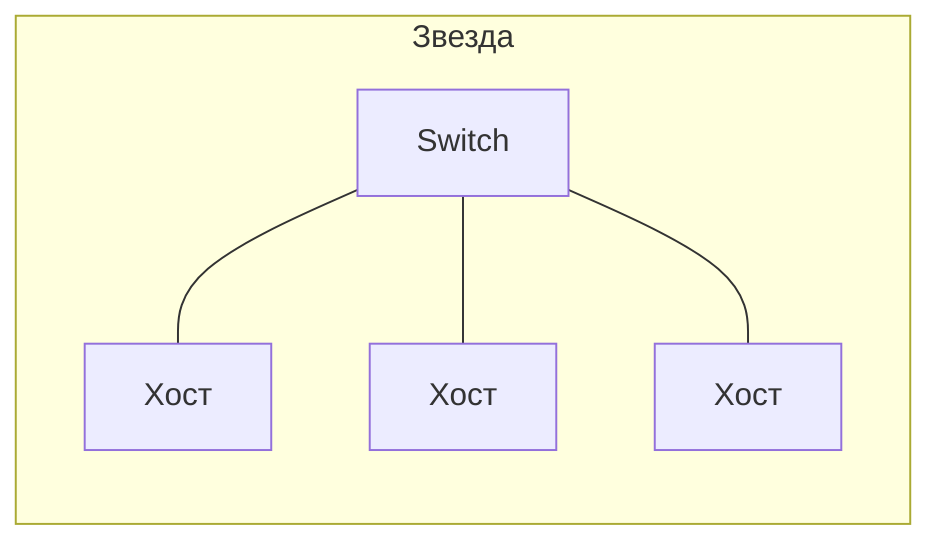

# Топология сети

## TL;DR
Способ, которым узлы соединены каналами связи: **шина**, **звезда**, **кольцо**, **дерево**, **mesh**, **гибридная**. Топология определяет отказоустойчивость, стоимость, ёмкость и сложность маршрутизации.

## Какую проблему решает
Каналы и порты стоят денег. Соединить «всех со всеми» — дорого и не масштабируется (n узлов → ~n²/2 каналов). Топология — это компромисс между **стоимостью**, **производительностью** (нет ли узкого места) и **отказоустойчивостью** (что ломается, если оборвётся канал).

## Как работает
- **Шина:** все узлы на одном кабеле. Дёшево, но коллизии и единая точка отказа. Пример — старый «толстый» Ethernet 10BASE5.
- **Звезда:** все узлы — к центральному узлу (свитч/хаб). Отказ центра ломает всю сеть, но проще диагностика. Современный LAN.
- **Кольцо:** каждый узел соединён с двумя соседями. Token Ring, FDDI. Detерминированный доступ, но обрыв кольца — катастрофа без двойного кольца.
- **Дерево:** иерархия. Естественно для физической прокладки в здании.
- **Mesh (полносвязная):** все со всеми (или почти). WAN-ядра, межрегиональные сети. Дорого, но переживает много отказов.
- **Гибридная:** комбинация. Реальные сети почти всегда такие.

## Пример
Дома: звезда вокруг роутера. В офисе: дерево — «коммутатор этажа → коммутатор отдела → рабочие места». Между дата-центрами Google: близко к mesh — каналов много для отказоустойчивости и балансировки.

## Связи
- **Базируется на:** [[Компьютерная сеть]] — топология описывает её физический/логический скелет.
- **Используется в:** [[Ethernet — IEEE 802.3]] (звезда коммутаторов), [[Spanning Tree Protocol]] (превращает физическое mesh в логическое дерево).
- **Соседи по уровню:** [[Типы сетей по охвату]] — разные охваты часто тяготеют к разным топологиям.
- **Противопоставляется:** не все mesh — равноправные. Различай **физическую** топологию (как кабели проложены) и **логическую** (как идёт трафик).

## Подводные камни
- Логическая топология может отличаться от физической. Wi-Fi на вид — звезда вокруг AP, но физически — общий радиоэфир (шина).
- «Mesh» в маркетинге Wi-Fi-роутеров часто означает несколько AP с роумингом — это не полносвязный mesh L1.

## Дальше читать
- [[Spanning Tree Protocol]] — как превратить mesh-связность в безопасное дерево.
- [[Типы сетей по охвату]] — где какая топология типична.
- Tanenbaum, гл. 1, §1.3 (стр. PDF 41–53).
