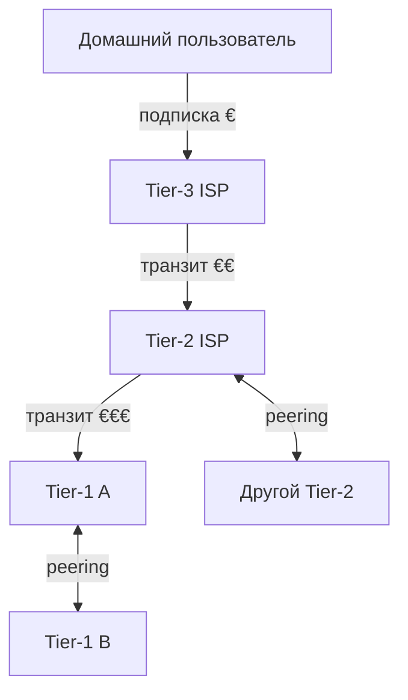

# Транзитная сеть (transit, IP transit, ISP-tier)

## TL;DR
Деление операторов интернета по тому, **с кем и как** они связаны. Tier-1 — магистральные, не покупают транзит ни у кого. Tier-2 — покупают транзит у Tier-1 и пиринговы между собой. Tier-3 — последняя миля, продают доступ конечным пользователям. Транзит — платная услуга «пропусти мой трафик куда угодно в интернете».

## Какую проблему решает
Никто не может построить кабель к каждому дому в мире, и не должен. Архитектура операторов формируется **экономически**: одни строят магистраль и продают её другим; те — региональным; те — пользователям. Транзит и пиринг — два механизма, как этим расплачиваются.

## Как работает

**Транзит:** A платит B за «передавай мой трафик куда угодно». B анонсирует A в [[BGP]] всем своим связям. Дорого, но даёт связность со всем миром.

**Пиринг:** A и B обмениваются **только** трафиком своих клиентов. Бесплатно (settlement-free) или платно (paid peering). Не даёт связности «куда угодно», только до клиентов партнёра.

| Tier | Что значит | Примеры |
|---|---|---|
| **1** | не покупает транзит ни у кого; пиринг с другими Tier-1 | Lumen (Level 3), NTT, Telia, Tata, Cogent, Hurricane Electric |
| **2** | покупает транзит у Tier-1, пиринг с другими Tier-2 | Comcast, Vodafone, Orange |
| **3** | покупает у Tier-1/2, продаёт пользователям и бизнесам | большинство региональных ISP |

## Пример
Ты заходишь на сайт в Японии. Твой пакет:
1. Дом → Tier-3 ISP.
2. Tier-3 платит Tier-2 за транзит → Tier-2.
3. Tier-2 платит Tier-1 за транзит → Tier-1 (например, NTT).
4. Tier-1 пирингуется в Токио с японским Tier-1 → доходит до конечного хоста.

Деньги текут «снизу вверх» (пользователь → Tier-3 → Tier-2 → Tier-1), трафик — в обе стороны.

## Связи
- **Базируется на:** [[Интернет — архитектура]] — это её экономическая модель.
- **Используется в:** [[BGP]] — технический способ выражения «вот что я вам передаю», основанный на этих отношениях.
- **Соседи по уровню:** IXP — точка обмена трафиком, физически реализующая пиринг.
- **Противопоставляется:** иерархия «Tier-1 → конечный пользователь» — не строгая. Многие крупные контент-сети (Google, Meta, Netflix) — фактически Tier-1, потому что их сети глобальны.

## Подводные камни
- Tier-1 — индустриальная классификация, не RFC. Нет официального списка.
- Современный интернет всё больше **уплощается**: контент-сети выходят прямо в Tier-3 ISP через CDN-узлы, минуя верхние уровни.
- Пиринг между крупными игроками — поле политики и денег: см. кейсы Cogent vs Hurricane Electric (depeering ради конкуренции).

## Дальше читать
- [[BGP]] — протокол, выражающий эти отношения.
- [[Интернет — архитектура]] — общая картина.
- Tanenbaum, гл. 1, §1.2.4 (стр. PDF 38–39).
