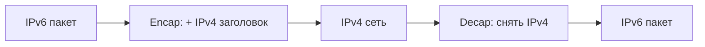

# Туннелирование (tunneling)

## TL;DR
**Инкапсуляция** одного протокола внутри другого: «пакет в пакете». Используется для проводки L2/L3-пакета через сеть, где такого протокола нет (IPv6 поверх IPv4), для приватности (IPsec/WireGuard), для логического объединения сетей (GRE между офисами), для построения overlay-сетей (VXLAN в DC).

## Какую проблему решает
Интернет — IPv4. Хочешь IPv6? Многие провайдеры не предоставляют. Решение: упаковать IPv6-пакеты внутри IPv4 — отправить в туннель — на другом конце развернуть. Тот же приём — для VPN, для DC-overlay'ев, для virtual networks в облаках.

## Как работает

**Базовая идея:**
- На входе **encapsulation:** к исходному пакету добавляется новый заголовок снаружи.
- В сети middle видят только внешний заголовок.
- На выходе **decapsulation:** внешний заголовок снимается, исходный пакет идёт дальше.

**Типы туннелей:**

| Туннель | Что внутри | Что снаружи | Зачем |
|---|---|---|---|
| **6in4** | IPv6 | IPv4 | переход IPv4→IPv6 |
| **GRE** | любой L3 | IPv4/IPv6 | site-to-site |
| **IPsec** | IP-пакет (encrypted) | IP | secure VPN |
| **WireGuard** | IP | UDP | modern VPN |
| **L2TP** | L2-фрейм | IP/UDP | удалённый L2-доступ |
| **VXLAN** | L2 Ethernet | UDP/IP | DC overlay, multitenancy |
| **GTP** | IP абонента | UDP | мобильное ядро 4G/5G |
| **MPLS** | label-switched | label-stack over Ethernet | provider backbone |

**MTU-проблема:** туннель добавляет байты заголовка → effective MTU уменьшается. Без PMTUD ([[Internetworking — фрагментация]]) — баги.

## Пример
**Корпоративный IPsec site-to-site:**
- Офис в Москве (10.1.0.0/16) и в Питере (10.2.0.0/16).
- Между ними публичный интернет.
- IPsec-туннель: пакет 10.1.x → 10.2.y инкапсулируется в IPsec ESP, новый IP-заголовок с публичными адресами шлюзов, шифруется.
- Через интернет идёт «обычный» IP-пакет.
- В Питере — decapsulate, расшифровать → исходный пакет в офисную LAN.

Снаружи это выглядит как пара «один→один шлюзов»; внутри это полная связность двух офисов.

## Связи
- **Базируется на:** [[Сетевой уровень]] (универсальный приём — инкапсуляция).
- **Используется в:** [[VPN]], [[IPsec]], [[MPLS]], [[IPv6]] (transition tunnels), VXLAN (DC).
- **Соседи по уровню:** [[Internetworking — фрагментация]] — частая проблема туннелей.
- **Противопоставляется:** «native» соединение — без overhead, но требует homogeneity сети.

## Подводные камни
- **Overhead туннеля** — обычно 20–60 байт. Полезная пропускная способность снижается.
- **MTU-проблемы** — самая частая причина «работает в LAN, не работает через VPN».
- **Производительность шифрования** — IPsec/WireGuard упирается в CPU (или нужна аппаратная ускорение).
- **Trust boundary** — туннель шифрует канал, но не защищает от взломанных endpoint'ов.

## Дальше читать
- [[IPsec]], [[VPN]] — secure tunnels.
- [[MPLS]] — оператор-уровень.
- Tanenbaum, гл. 5, §5.5.5 (стр. PDF 485–488).
