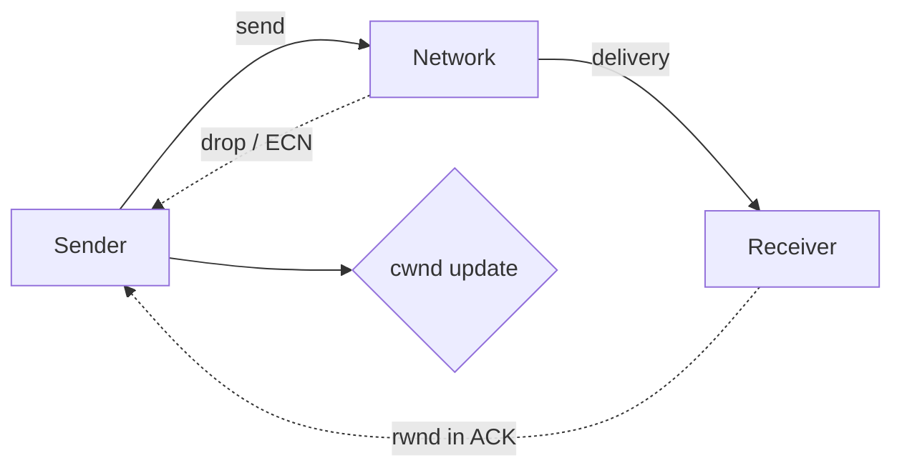

# Управление потоком vs контроль перегрузки

## TL;DR
**Flow control** — защита **получателя**: «не шли быстрее, чем я могу принимать» (TCP receive window, rwnd). **Congestion control** — защита **сети**: «не шли быстрее, чем сеть может доставить» (TCP cwnd). Эффективная скорость отправителя = `min(rwnd, cwnd)`. Часто путают, но это **разные** механизмы с **разными целями**.

## Какую проблему решает
Если бы TCP реагировал только на скорость **получателя** (rwnd), сеть могла бы перегружаться даже когда оба хоста быстрые — узкое место в магистрали. Если только на сеть (cwnd), быстрый отправитель утопил бы медленный приёмник. Нужны **оба** регулятора.

## Как работает

| | Flow Control | Congestion Control |
|---|---|---|
| Кого защищает | получатель | сеть |
| Сигнал | rwnd в ACK | потери, ECN, RTT |
| Размер окна | rwnd | cwnd |
| Управляется | получателем | отправителем |
| Алгоритмы | sliding window, window scaling | slow start, AIMD, CUBIC, BBR |

**Эффективное окно отправителя:** `effective_wnd = min(rwnd, cwnd) − bytes_in_flight`.

**Конкретные источники сигнала:**
- Flow control: получатель в каждом ACK сообщает свой `rwnd` (в TCP-заголовке поле Window).
- Congestion control: отправитель сам наблюдает потери (timeout, dup-ACK) или ECN-метки.

## Пример
**Слабый IoT-получатель + быстрый сервер на хорошей сети:**
- Сервер мог бы слать 1 Гбит/с.
- IoT обрабатывает 100 кбит/с → rwnd ≈ 10 КБ.
- Сервер ограничен rwnd → не более 100 кбит/с. Сеть свободна.

**Быстрый получатель + перегруженная сеть:**
- rwnd = 64 КБ (max без window scaling).
- BDP сети = 1 МБ → cwnd мог быть 1 МБ.
- Эффективное окно = min(64, 1024) = 64 КБ → недоутилизация.
- Window scaling решает: rwnd до ГБ.

## Связи
- **Базируется на:** [[Транспортный уровень]] (где живут оба механизма).
- **Используется в:** [[TCP — раздвижное окно]] (rwnd — flow), [[AIMD]], [[TCP — slow start]], [[CUBIC TCP]], [[BBR]] (cwnd — congestion).
- **Соседи по уровню:** [[Перегрузка сети]] — на L3 — congestion bone'а.
- **Противопоставляется:** именно эта пара. Не путать!

## Подводные камни
- **«Зависает скачивание»** — может быть и flow-bounded (получатель медленный), и cwnd-bounded (сеть). Диагностика разная.
- **Window scaling** (RFC 1323) — обязателен для современных high-BDP. Без него rwnd максимум 64 КБ.
- В QUIC оба механизма реализованы аналогично, но **per-stream flow control** (одно соединение → много стримов).

## Дальше читать
- [[TCP — раздвижное окно]] — flow control в действии.
- [[AIMD]], [[TCP — slow start]] — congestion control.
- [[Перегрузка сети]] — общий контекст.
- Tanenbaum, гл. 6, §6.2.4; §6.3 (стр. PDF 590–611).
