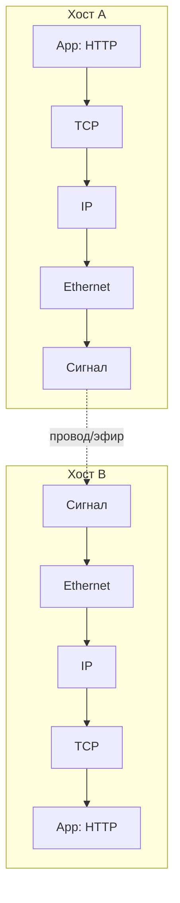

# Уровневая архитектура (layering, protocol stack)

## TL;DR
Способ управлять сложностью: разбить общение в сети на несколько **уровней**, каждый из которых решает узкую задачу и предоставляет **службу** уровню выше через чёткий интерфейс. Верхний уровень не знает, **как** нижний работает; нижний не знает, **что** именно несёт верхний. Так появляется «стек протоколов».

## Какую проблему решает
Сделать «всё сразу» — нелегко: и упаковать байты в сигнал, и обнаружить ошибки, и найти путь, и собрать поток, и зашифровать, и показать страницу. Без слоёв изменение одной части ломало бы остальные.

**Аналогия с почтой:** отправитель пишет письмо, не зная, какой грузовик его повезёт. Почтальон в сортировочном центре смотрит индекс на конверте, не читая текст. Грузовик едет по дороге, не зная, что в нём конверты. Каждый делает своё. В сети так же: приложение пишет HTTP-запрос, не зная про IP; маршрутизатор читает IP, не разбирая HTTP; провод проводит биты, не зная ничего.

Слои дают:
- **разделение ответственности** — каждый уровень делает одно;
- **подменяемость** — Wi-Fi заменили на Ethernet, IP-уровень не заметил;
- **переиспользование** — один TCP работает поверх IPv4 и IPv6;
- **независимое тестирование** — можно отлаживать L2 без L7.

## Как работает
Каждый уровень N **общается логически** с уровнем N на другой машине, **физически** — через уровень N−1 на своей. Данные при отправке проходят сверху вниз, и каждый уровень добавляет свой заголовок (**инкапсуляция** — упаковка данных в новый «конверт» с заголовком, как письмо вкладывают в курьерский пакет, тот — в мешок, мешок — в грузовик). На приёме — снизу вверх, заголовки снимаются (**декапсуляция** — обратная распаковка матрёшки).

«Логические» горизонтальные стрелки — это **протокол** уровня (что обсуждают равные уровни). Вертикальные — **служба** (что нижний даёт верхнему). См. [[Протокол vs служба]].

## Пример
Открываешь страницу:
1. **L7 (HTTP):** GET /index.html.
2. **L4 (TCP):** упаковывает в сегмент с портами и seq.
3. **L3 (IP):** добавляет адрес назначения.
4. **L2 (Ethernet):** упаковывает в фрейм с MAC.
5. **L1:** биты в провод.

На сервере — обратно. На промежуточных маршрутизаторах фрейм/IP-заголовок меняется, TCP-сегмент **не вскрывается** (в идеале). Это и есть инкапсуляция в действии.

## Связи
- **Базируется на:** [[Компьютерная сеть]] — это её архитектурный приём.
- **Используется в:** [[Эталонная модель OSI]] (7 уровней), [[Эталонная модель TCP/IP]] (4), [[Гибридная модель Tanenbaum]] (5).
- **Соседи по уровню:** [[Протокол vs служба]] — словарь для уровней.
- **Противопоставляется:** «монолитная» архитектура — всё в одном куске. Не масштабируется и не эволюционирует.

## Подводные камни
- Разделение на уровни — **модель**, не закон физики. Реальные системы нарушают слои ради скорости (TCP offload в NIC, fast path с шифрованием в L2).
- Заголовки от каждого уровня **накладываются** — это overhead. Для маленьких полезных нагрузок (VoIP-пакет) суммарные заголовки могут быть больше payload.
- Уровни могут «протекать»: TCP «знает» про потерю пакетов IP-уровня (через таймауты), DNS живёт на L7, но без него L4 ни до кого не дойдёт.

## Дальше читать
- [[Протокол vs служба]] — словарный разбор.
- [[Эталонная модель OSI]] — теоретический эталон с 7 уровнями.
- [[Гибридная модель Tanenbaum]] — практическая 5-уровневая, по которой написана книга.
- Tanenbaum, гл. 1, §1.5–1.6 (стр. PDF 76–98).
