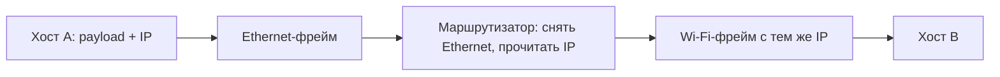

# Фрейм (frame, кадр)

## TL;DR
**Единица канального уровня**: пакет данных с заголовком (откуда/куда/тип), полезной нагрузкой и контрольной суммой (CRC) для обнаружения ошибок. На каждом канале — свой формат: Ethernet-фрейм отличается от Wi-Fi-фрейма от PPP-фрейма. На границах хопов один фрейм заменяется другим, а IP-пакет внутри остаётся.

## Какую проблему решает
В физическом канале нет понятия «начало» и «конец» — это поток битов. Чтобы передать что-то осмысленное, нужно **обозначить границы**, добавить **метаданные** (адреса, тип содержимого) и **проверку целостности**. Фрейм — это контейнер, в котором всё это упаковано.

## Как работает

**Структура типового фрейма** (упрощённо):

```
+---------+-----------+----------------+-------+
| Header  | Payload   | Trailer (CRC)  | Stop  |
| (адреса,| (данные)  | контр. сумма   | флаг  |
| тип, …) |           |                |       |
+---------+-----------+----------------+-------+
```

**Конкретные примеры:**

| Тип фрейма | Длина заголовка | Адресация | Контроль |
|---|---|---|---|
| **Ethernet** | 14 байт + опц. VLAN-тег 4 байта | 2× MAC по 6 байт + EtherType 2 байта | CRC-32 |
| **Wi-Fi (802.11)** | 24+ байта | до 4× MAC по 6 байт | CRC-32 |
| **PPP/HDLC** | 5 байт | флаг + адрес + контроль + протокол | CRC-16/32 |
| **SONET-фрейм** | 9 байт overhead | path/line/section | parity, B1/B2/B3 байты |

**Размеры:**
- Ethernet payload: 46–1500 байт (стандарт; есть jumbo до 9000).
- Wi-Fi payload: до 2304 байт.
- IP-пакет вкладывается в payload фрейма.

**Инкапсуляция при движении по сети:**



L2-заголовок меняется на каждом хопе; L3 (IP) идёт сквозь.

## Пример
Скачивание файла, конкретный пакет:
- IP-пакет 1500 байт.
- Помещается в **Ethernet-фрейм** (1518 байт всего: 14 заголовок + 1500 payload + 4 CRC).
- Маршрутизатор снимает Ethernet → читает IP → упаковывает в **Wi-Fi-фрейм** (~1540 байт).
- Wi-Fi принимает, проверяет CRC. Совпало → передаёт IP вверх.

## Связи
- **Базируется на:** [[Канальный уровень]] — фрейм — его единица; [[Формирование фреймов]] — как очертить границы.
- **Используется в:** [[Ethernet — IEEE 802.3]] (Ethernet-фрейм), [[802.11 — Wi-Fi архитектура]], [[PPP]] — конкретные форматы.
- **Соседи по уровню:** [[CRC — циклический избыточный код]] — обычное trailer-поле.
- **Противопоставляется:** **пакет** (L3, IP) — концептуально живёт внутри фрейма; **сегмент** (L4, TCP/UDP) — внутри пакета.

## Подводные камни
- **Frame ≠ packet ≠ segment.** Это слои:
  - Bit/symbol — L1
  - **Frame** — L2
  - **Packet** — L3
  - **Segment** — L4 (TCP) / **Datagram** — L4 (UDP)
- В разговорной речи «пакет» часто используется как зонтичный термин — будь осторожен в формальных текстах.
- Контрольная сумма во фрейме защищает только **per-hop** — на следующем хопе пересчитывается. Если маршрутизатор повреждает данные в памяти, IP-checksum это не всегда поймает.

## Дальше читать
- [[Формирование фреймов]] — как обозначить границы.
- [[CRC — циклический избыточный код]] — детектирование ошибок.
- [[Ethernet — IEEE 802.3]] — самый распространённый формат.
- Tanenbaum, гл. 3, §3.1.2 (стр. PDF 246–250).
