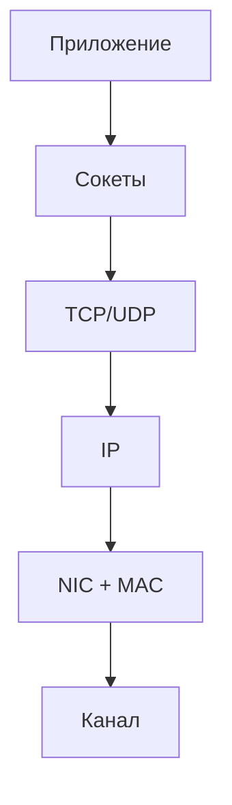

# Хост (host, end system)

## TL;DR
Конечный узел сети — машина, которая **создаёт или потребляет** трафик: ноутбук, телефон, сервер, IoT-датчик. В отличие от маршрутизатора, хост не пересылает чужие пакеты «насквозь» (за редкими исключениями вроде гипервизора).

## Какую проблему решает
Чтобы говорить о сети, нужно отделить «кто хочет что-то отправить или получить» (хост) от «кто помогает этому добраться» (маршрутизатор). Это разделение задаёт основу адресации и маршрутизации: пакеты идут **между хостами**, а маршрутизаторы — лишь промежуточные станции.

## Как работает
У хоста есть как минимум одна сетевая карта (NIC) с MAC-адресом и (после настройки) IP-адресом. ОС реализует сетевой стек: приложения вызывают [[Сокеты Беркли]], стек упаковывает данные в TCP/UDP-сегмент → IP-пакет → канальный фрейм и отдаёт NIC. Входящие пакеты обходят стек в обратном направлении.

## Пример
Сервер `nginx` на VPS — хост: слушает 80/443. Твой телефон в Wi-Fi — тоже хост: открывает страницу. Обе машины имеют IP, обе **источник или приёмник** данных. Wi-Fi-роутер между ними — не хост, а маршрутизатор: он пакеты пересылает.

## Связи
- **Базируется на:** [[Компьютерная сеть]] — хост существует только как узел сети.
- **Используется в:** [[Сокеты Беркли]] — API хоста для приложения; [[IP-адресация и CIDR]] — каждый хост идентифицируется IP.
- **Соседи по уровню:** [[Маршрутизатор]] — другая роль узла в той же сети.
- **Противопоставляется:** [[Маршрутизатор]] — пересылает чужие пакеты, не источник трафика приложения.

## Подводные камни
- Хост может **технически** маршрутизировать (включил `ip_forward`) — но это не его роль; в моделировании сети это маршрутизатор.
- «Конечный» здесь не про физическое расположение, а про **роль в стеке**: хост работает на всех 5/7 уровнях модели, маршрутизатор обычно — до сетевого включительно.

## Дальше читать
- [[Маршрутизатор]] — вторая роль узла.
- [[Уровневая архитектура]] — почему хост проходит весь стек, а маршрутизатор — нет.
- Tanenbaum, гл. 1, §1.1, 1.5.2 (стр. PDF 26–33, 78–82).
