# Цифровая модуляция — линейные коды (line coding)

## TL;DR
Способ представления **0 и 1 уровнями напряжения/тока в проводе**: какой импульс — какой бит. Главные представители: **NRZ** (нет смены при равных битах), **NRZI** (смена = 1), **Manchester** (смена в середине каждого бита, самосинхронизация), **4B/5B** и **8B/10B** (балансировка постоянной составляющей + синхронизация).

## Какую проблему решает
Простой подход «высокий уровень = 1, низкий = 0» (NRZ) ломается на длинных последовательностях одинаковых бит: приёмник теряет тактовую синхронизацию (нет переходов = нет момента отсчёта), и на постоянной составляющей возникает дрейф напряжения. Линейные коды решают **синхронизацию** и **DC-balance** ценой расхода полосы.

## Как работает

| Код | Описание | Свойства |
|---|---|---|
| **NRZ** (Non-Return-to-Zero) | 0 → низкий уровень, 1 → высокий, держится весь битовый интервал | простой, но не самосинхронизируемый, есть DC |
| **NRZI** (NRZ Inverted) | 1 = переход уровня; 0 = нет перехода | синхронизация при «1», теряется при длинных «0» |
| **Manchester** | 1 = переход вверх в середине; 0 = переход вниз. Каждый бит — гарантированный переход | самосинхронизация, нет DC; **двойная** полоса (нужно 2 перехода на бит) |
| **Differential Manchester** | переход в начале = 0; нет перехода = 1; всегда переход в середине | устойчив к инверсии полярности |
| **4B/5B** | 4 бита данных → 5-битный код, гарантирующий ≥1 перехода | overhead 25%, используется в 100BASE-FX, FDDI |
| **8B/10B** | 8 бит → 10-битный код с DC-balance | overhead 25%, используется в Gigabit Ethernet, Fibre Channel, PCIe |

```mermaid
gantt
  dateFormat ss
  title NRZ vs Manchester для битов 1 0 1 1 0
  section NRZ
  bit_1_high :a1, 00, 1
  bit_0_low :a2, 01, 1
  bit_1_high :a3, 02, 1
  bit_1_high :a4, 03, 1
  bit_0_low :a5, 04, 1
  section Manchester
  переход_вверх_середина :b1, 00, 1
  переход_вниз_середина :b2, 01, 1
  переход_вверх_середина :b3, 02, 1
  переход_вверх_середина :b4, 03, 1
  переход_вниз_середина :b5, 04, 1
```

## Пример
- **Старый Ethernet 10BASE-T:** Manchester. Простой и надёжный, но требует 20 МГц-полосы для 10 Мбит/с.
- **Fast Ethernet 100BASE-TX:** 4B/5B + MLT-3 (трёхуровневый код), полоса меньше.
- **Gigabit Ethernet 1000BASE-T:** PAM-5 на 4 парах + 8B/10B-родственный код.
- **PCIe / Fibre Channel:** 8B/10B (PCIe 3.0+) или 128B/130B (PCIe 4+) с очень малой избыточностью.

## Связи
- **Базируется на:** [[Среда передачи данных]] — линейные коды для проводных сред в основном.
- **Используется в:** [[Ethernet — IEEE 802.3]] (Manchester в classic, 4B/5B в Fast, 8B/10B в Gigabit).
- **Соседи по уровню:** [[Цифровая модуляция — амплитуда-частота-фаза]] — для **аналоговых** (несущих) сигналов.
- **Противопоставляется:** аналоговая модуляция — там бит → фаза/частота несущей, а не уровень напряжения.

## Подводные камни
- Manchester «жжёт полосу» (×2) — поэтому в высокоскоростном Ethernet от него ушли.
- 4B/5B / 8B/10B вводят **служебные символы** (idle, sync) — часть кодового пространства не несёт данных.
- В современном Ethernet (10G/40G/100G) часто используются **PAM-4/PAM-8** с FEC — это уже ближе к аналоговой модуляции, чем к простому line coding.

## Дальше читать
- [[Цифровая модуляция — амплитуда-частота-фаза]] — модуляция несущей.
- [[Ethernet — IEEE 802.3]] — что использует какие коды.
- Tanenbaum, гл. 2, §2.4.3 (стр. PDF 149–158).
